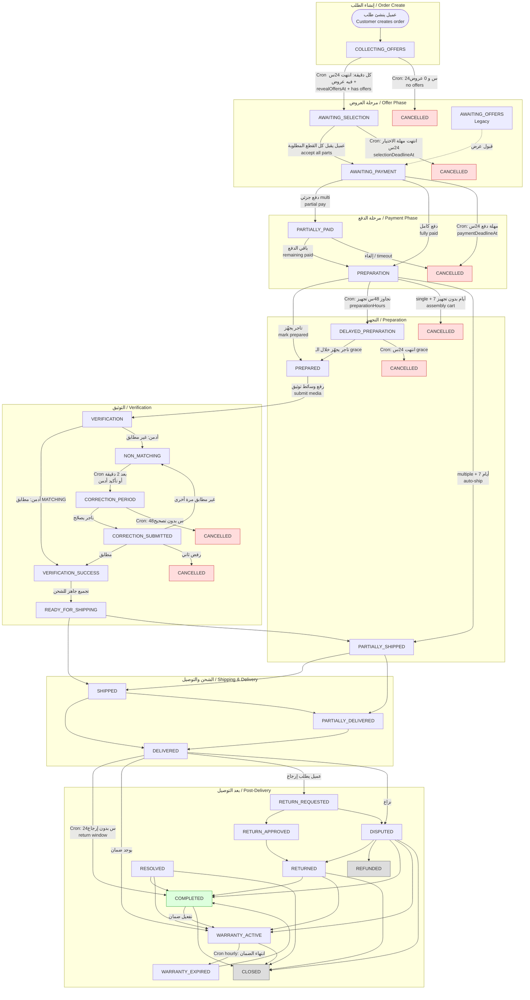
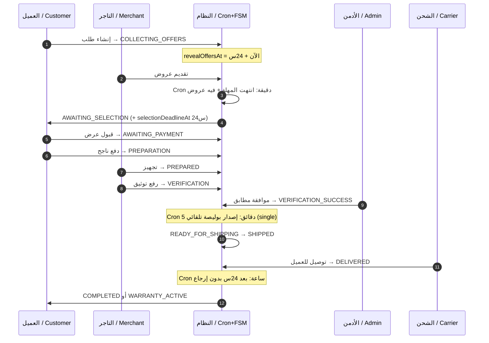
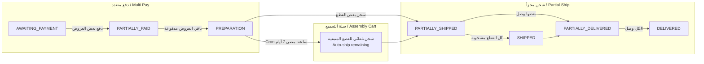
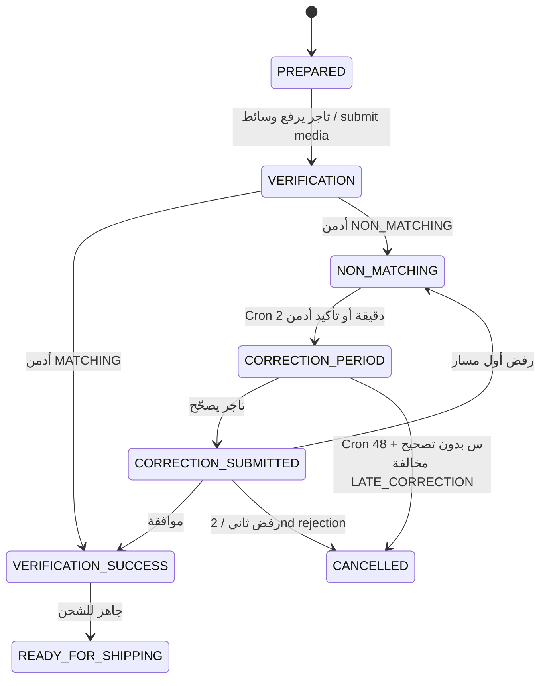
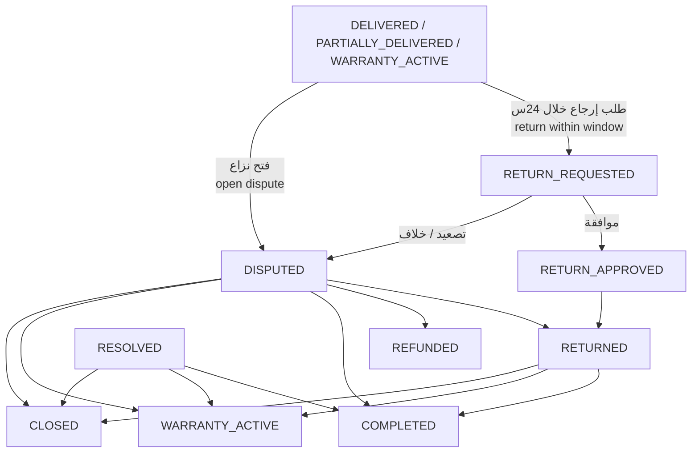
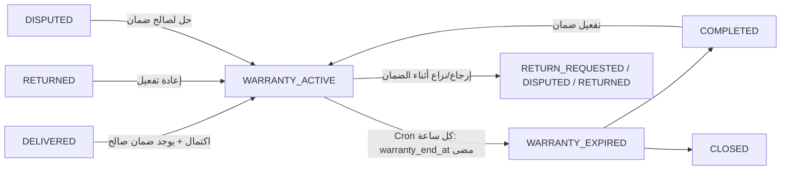

# حالات الطلب في المنصة / Order Statuses Lifecycle

> **مصدر الحقيقة / Source of Truth:** `backend/prisma/schema.prisma` → `OrderStatus` (29 حالة)  
> **آلة الحالات / FSM:** `backend/src/orders/fsm/order-state-machine.service.ts`  
> **المدد الافتراضية / Durations:** `backend/src/common/order-duration-config.service.ts` (قابلة للتعديل عبر `platformSettings.system_config.orderDurations`)  
> **التنظيف الزمني / Cleanup crons:** `backend/src/scheduler/order-cleanup.service.ts`

---

## فهرس سريع / Quick Index

1. [جدول كل الحالات / All Statuses Table](#1-جدول-كل-الحالات--all-statuses-table)
2. [مخطط التدفق الكامل / Full Data Flow](#2-مخطط-التدفق-الكامل--full-data-flow-diagram)
3. [المسار السعيد / Happy Path](#3-المسار-السعيد--happy-path)
4. [سيناريوهات متعددة القطع / Multi-Item Scenarios](#4-سيناريوهات-متعددة-القطع--multi-item--assembly-cart)
5. [التوثيق والتصحيح / Verification & Correction](#5-التوثيق-والتصحيح--verification--correction)
6. [الإرجاع والنزاع / Returns & Disputes](#6-الإرجاع-والنزاع--returns--disputes)
7. [الضمان / Warranty](#7-الضمان--warranty)
8. [تفاصيل كل حالة / Per-Status Details](#8-تفاصيل-كل-حالة--per-status-details)
9. [Cron Jobs والجداول الزمنية / Cron Jobs & Timers](#9-cron-jobs-والجداول-الزمنية--cron-jobs--timers)
10. [المدد القابلة للضبط / Configurable Durations](#10-المدد-القابلة-للضبط--configurable-durations)

---

## 1. جدول كل الحالات / All Statuses Table

| # | Enum (EN) | العربية (UI) | English (UI) | مرحلة / Phase | Timer / Cron؟ |
|---|-----------|--------------|--------------|---------------|---------------|
| 1 | `COLLECTING_OFFERS` | جاري جمع أفضل العروض | Collecting Best Offers | عروض / Offers | ✅ 24h → reveal |
| 2 | `AWAITING_SELECTION` | بانتظار اختيارك للقطع | Awaiting Your Selection | عروض / Offers | ✅ 24h selection |
| 3 | `AWAITING_OFFERS` | بانتظار العروض | Awaiting Offers | تراثي / Legacy | ⚠️ قديم — الطلبات الجديدة تبدأ بـ `COLLECTING_OFFERS` |
| 4 | `AWAITING_PAYMENT` | بانتظار الدفع | Awaiting Payment | دفع / Payment | ✅ 24h payment |
| 5 | `PARTIALLY_PAID` | دفع جزئي | Partially Paid | دفع / Payment | ❌ (تجميع عروض) |
| 6 | `PREPARATION` | قيد التجهيز | Preparation | تجهيز / Prep | ✅ 48h + 7 أيام سلة |
| 7 | `PREPARED` | تم التجهيز | Prepared | تجهيز / Prep | ❌ يدوي تاجر |
| 8 | `VERIFICATION` | قيد فحص القطعة | Part Inspection | توثيق / Verify | ❌ ضابط/أدمن |
| 9 | `VERIFICATION_SUCCESS` | توثيق ناجح | Verification Approved | توثيق / Verify | ✅ waybill كل 5 دقائق (single) |
| 10 | `READY_FOR_SHIPPING` | جاهز للتسليم لشركة الشحن | Ready for Shipping | شحن / Ship | ❌ |
| 11 | `NON_MATCHING` | غير مطابق | Non-Matching | توثيق / Verify | ✅ 2 دقيقة → تصحيح |
| 12 | `CORRECTION_PERIOD` | فترة التصحيح | Correction Period | توثيق / Verify | ✅ 48h ثم إلغاء |
| 13 | `CORRECTION_SUBMITTED` | تم تصحيح التوثيق | Correction Submitted | توثيق / Verify | ❌ إعادة فحص |
| 14 | `DELAYED_PREPARATION` | متأخر في التجهيز | Delayed Preparation | تجهيز / Prep | ✅ grace 24h ثم إلغاء |
| 15 | `PARTIALLY_SHIPPED` | مشحون جزئياً | Partially Shipped | شحن / Ship | ✅ auto-ship (multi) |
| 16 | `SHIPPED` | تم الشحن | Shipped | شحن / Ship | ❌ تتبع شحنة |
| 17 | `PARTIALLY_DELIVERED` | مُسلَّم جزئياً | Partially Delivered | توصيل / Delivery | ✅ نافذة إرجاع لكل عرض |
| 18 | `DELIVERED` | تم التوصيل | Delivered | توصيل / Delivery | ✅ 24h → اكتمال |
| 19 | `COMPLETED` | مكتمل | Completed | ختام / End | ❌ (قد ينتقل لضمان) |
| 20 | `CANCELLED` | ملغى | Cancelled | نهائي / Terminal | — |
| 21 | `RETURNED` | مرتجع | Returned | إرجاع / Return | ❌ |
| 22 | `DISPUTED` | نزاع | Disputed | نزاع / Dispute | ✅ escalation hourly |
| 23 | `RETURN_REQUESTED` | طلب إرجاع | Return Requested | إرجاع / Return | ✅ escalation hourly |
| 24 | `RETURN_APPROVED` | موافقة على الإرجاع | Return Approved | إرجاع / Return | ❌ |
| 25 | `REFUNDED` | تم الاسترداد | Refunded | نهائي / Terminal | — |
| 26 | `RESOLVED` | تم الحل | Resolved | ختام / End | ❌ |
| 27 | `CLOSED` | قضية مغلقة | Case Closed | نهائي / Terminal | — |
| 28 | `WARRANTY_ACTIVE` | الضمان نشط | Warranty Active | ضمان / Warranty | ✅ hourly expiry |
| 29 | `WARRANTY_EXPIRED` | الضمان منتهي | Warranty Expired | ضمان / Warranty | ❌ |

---

## 2. مخطط التدفق الكامل / Full Data Flow Diagram

---

## 3. المسار السعيد / Happy Path

**طلب فردي (single) — بدون مشاكل**

| خطوة | الحالة | من يفعل؟ | توقيت / Cron |
|------|--------|----------|--------------|
| إنشاء | `COLLECTING_OFFERS` | عميل | `revealOffersAt` ≈ 24h |
| كشف العروض | `AWAITING_SELECTION` | Cron كل دقيقة | بعد انتهاء نافذة الجمع |
| قبول | `AWAITING_PAYMENT` | عميل | `paymentDeadlineAt` ≈ 24h |
| دفع | `PREPARATION` | بوابة دفع / webhook | — |
| تجهيز | `PREPARED` | تاجر | — |
| فحص | `VERIFICATION` | تاجر يرفع وسائط | — |
| موافقة | `VERIFICATION_SUCCESS` | أدمن | waybill auto كل 5 دقائق |
| جاهز | `READY_FOR_SHIPPING` | تجميع عروض | — |
| شحن | `SHIPPED` | شحنة / تاجر | — |
| توصيل | `DELIVERED` | شركة الشحن | — |
| اكتمال | `COMPLETED` / `WARRANTY_ACTIVE` | Cron كل ساعة | بعد 24h نافذة إرجاع |

---

## 4. سيناريوهات متعددة القطع / Multi-Item & Assembly Cart

`requestType = 'multiple'` يفعّل حالات جزئية وتجميع سلة.

| السيناريو AR | Scenario EN | النتيجة / Result | Cron؟ |
|--------------|-------------|------------------|-------|
| دفع جزء من العروض المقبولة | Partial payment of accepted offers | `PARTIALLY_PAID` | ❌ تجميع فوري |
| اكتمال دفع كل العروض | All accepted offers paid | `PREPARATION` | ❌ |
| شحن بعض القطع فقط | Some offers shipped | `PARTIALLY_SHIPPED` | ❌ |
| توصيل بعض القطع فقط | Some offers delivered | `PARTIALLY_DELIVERED` | ❌ |
| انتهاء نافذة إرجاع لكل عرض على حدة | Per-offer 24h return window | إكمال العرض → قد يصل الطلب لـ `COMPLETED` | ✅ كل ساعة |
| 7 أيام في التجهيز (متعدد) | 7-day assembly cart (multiple) | شحن تلقائي للقطع المتبقية | ✅ كل ساعة + كل 6 ساعات |
| أجزاء بدون عروض عند الكشف | Some parts had no offers at reveal | يبقى الطلب في `AWAITING_SELECTION` + إشعار إعادة طلب | ❌ إشعار فقط |
| تأخر تجهيز قطعة واحدة (multi) بعد 48س+24س grace | One late prep part after 48h+24h grace | **تُلغى/تُسترد تلك القطعة فقط**؛ باقي القطع (مثل VERIFICATION) تكمل؛ Order لا يُلغى إلا إذا أُلغيت كل القطع المدفوعة | ✅ دقيقة |
| انتهاء مهلة تصحيح توثيق لقطعة (multi) | Per-offer 48h correction timeout | إلغاء/استرداد تلك القطعة فقط + مخالفة `LATE_CORRECTION` على متجرها | ✅ دقيقة |
| رفض توثيق ثاني لنفس القطعة (multi) | 2nd verification reject on same offer | إلغاء/استرداد تلك القطعة فقط (`rejectionCount` per-offer) | ❌ فوري |

> **قاعدة عزل القطع (2026):** في `requestType=multiple`، الإلغاء المالي والاسترداد يعملان على `PaymentTransaction.offerId` / `Offer.fulfillmentStatus=CANCELLED`. طلب فردي (`single`) يبقى إلغاء كلياً كما كان.

## 5. التوثيق والتصحيح / Verification & Correction

| السيناريو | Scenario | Cron / Timer |
|-----------|----------|--------------|
| رفض أول → فترة تصحيح | 1st non-match → correction | بعد `nonMatchingGraceMinutes` = **2 دقيقة** (Cron دقيقة) |
| مهلة تصحيح | Correction deadline | `correctionPeriodHours` = **48 ساعة** ثم `CANCELLED` + مخالفة `LATE_CORRECTION` |
| رفض ثاني | 2nd verification rejection | إلغاء فوري (بدون انتظار cron) |
| multi: مهلة/رفض قطعة | multi: per-offer timeout/2nd reject | إلغاء القطعة المعنية فقط؛ باقي القطع تكمل؛ Cron يمسح أيضاً `verificationDocuments.correctionDeadlineAt` المنتهية حتى لو الطلب ليس في `CORRECTION_PERIOD` |
| بوليصة ناقصة بعد نجاح التوثيق (فردي) | Missing waybill after success (single) | Cron كل **5 دقائق** يصدر بوليصة |

---

## 6. الإرجاع والنزاع / Returns & Disputes

| السيناريو | Scenario | Timer / Cron |
|-----------|----------|--------------|
| نافذة إرجاع/نزاع بعد التوصيل | Post-delivery return/dispute window | **24 ساعة** من `deliveredAt` (عرض أو طلب) |
| تذكير قبل انتهاء النافذة | Reminder before window ends | Cron كل **30 دقيقة** (~ساعتين قبل الانتهاء) |
| اكتمال تلقائي بعد النافذة | Auto-complete after quiet window | Cron كل **ساعة** |
| تصعيد تلقائي للإرجاع/النزاع | Auto-escalation | Cron كل **ساعة** (`ReturnsCronService`) |
| انتهاء تسليم الإرجاع | Expired return handovers | نفس الـ Cron الساعة |

---

## 7. الضمان / Warranty

- الدخول لـ `WARRANTY_ACTIVE` يتم عند اكتمال الطلب مع ضمان قابل للاستخدام (`resolveCompletionWarranty`).
- الخروج لـ `WARRANTY_EXPIRED` عبر **Cron كل ساعة** عندما `warranty_end_at < now`.

---

## 8. تفاصيل كل حالة / Per-Status Details

### 8.1 `COLLECTING_OFFERS` — جاري جمع أفضل العروض / Collecting Best Offers

| | AR | EN |
|--|----|----|
| **المعنى** | الطلب جديد ويتم جمع عروض التجار سراً قبل الكشف | New order; merchants bid privately before reveal |
| **كيف يدخل** | عند إنشاء الطلب | On order create |
| **سيناريوهات الخروج** | ① انتهاء النافذة + عروض → `AWAITING_SELECTION` ② انتهاء النافذة + صفر عروض → `CANCELLED` ③ إلغاء يدوي → `CANCELLED` | ① Window ends + offers → selection ② Window ends + 0 offers → cancelled ③ Manual cancel |
| **توقيت** | `revealOffersAt` ≈ **24 ساعة** (`offerCollectionHours`) | Same |
| **Cron** | ✅ `OrderCleanupService.handleCron` كل **دقيقة** → `handleCollectingOffersReveal` | Same |

---

### 8.2 `AWAITING_SELECTION` — بانتظار اختيارك للقطع / Awaiting Your Selection

| | AR | EN |
|--|----|----|
| **المعنى** | العروض ظاهرة والعميل يختار | Offers revealed; customer must choose |
| **كيف يدخل** | Cron بعد انتهاء جمع العروض | Cron after collection window |
| **سيناريوهات** | ① قبول كل القطع المطلوبة → `AWAITING_PAYMENT` ② انتهاء `selectionDeadlineAt` → `CANCELLED` ③ multi: قطع بدون عروض → إشعار reorder مع استمرار الباقي | ① Accept all needed parts → payment ② Selection timeout → cancelled ③ Multi: missing-offer parts → reorder notice |
| **توقيت** | **24 ساعة** (`offerSelectionHours`) | Same |
| **Cron** | ✅ كل دقيقة → `expireAwaitingSelection` | Same |

---

### 8.3 `AWAITING_OFFERS` — بانتظار العروض / Awaiting Offers *(Legacy)*

| | AR | EN |
|--|----|----|
| **المعنى** | حالة قديمة قبل نموذج الجمع السري | Legacy status before silent collection |
| **الاستخدام** | الطلبات الجديدة لا تبدأ بها | New orders do **not** start here |
| **خروج** | قبول → `AWAITING_PAYMENT` / إلغاء → `CANCELLED` | Accept → payment / cancel |
| **Cron خاص** | ❌ (إشعارات حوكمة قد تشملها مع `COLLECTING_OFFERS`) | Governance notify may include it |

---

### 8.4 `AWAITING_PAYMENT` — بانتظار الدفع / Awaiting Payment

| | AR | EN |
|--|----|----|
| **المعنى** | العرض/العروض مقبولة وبانتظار الدفع | Offer(s) accepted; awaiting payment |
| **كيف يدخل** | قبول عرض (فردي) أو قبول كل الأجزاء القابلة للاختيار | Accept offer / accept all selectable parts |
| **سيناريوهات** | ① دفع كامل → `PREPARATION` ② دفع جزئي (multi) → `PARTIALLY_PAID` ③ انتهاء المهلة → `CANCELLED` + مخالفة `ACCEPT_OFFER_NO_PAYMENT` | ① Full pay → prep ② Partial → partially paid ③ Timeout → cancelled + violation |
| **توقيت** | `paymentDeadlineAt` ≈ **24 ساعة** (`paymentTimeoutHours`) | Same |
| **Cron** | ✅ كل دقيقة → `expireAwaitingPayment` | Same |

---

### 8.5 `PARTIALLY_PAID` — دفع جزئي / Partially Paid

| | AR | EN |
|--|----|----|
| **المعنى** | بعض العروض المقبولة مدفوعة والبعض لا (طلبات متعددة) | Some accepted offers paid, not all |
| **كيف يدخل** | `OfferFulfillmentService.recomputeOrderStatus` بعد دفع جزئي | Aggregation after partial payment |
| **خروج** | اكتمال الدفع → `PREPARATION` / رجوع منطقياً لـ `AWAITING_PAYMENT` / إلغاء | Full pay → prep / back to awaiting payment / cancel |
| **Cron** | ❌ تغيير فوري عند الدفع | Immediate on payment webhook |

---

### 8.6 `PREPARATION` — قيد التجهيز / Preparation

| | AR | EN |
|--|----|----|
| **المعنى** | الدفع تم والتاجر يجهّز القطعة | Paid; merchant prepares the part |
| **كيف يدخل** | نجاح دفع كل العروض المقبولة | All accepted offers paid |
| **سيناريوهات** | ① تاجر يعلّم جاهز → `PREPARED` ② تجاوز 48س → `DELAYED_PREPARATION` ③ single + 7 أيام بدون تجهيز → `CANCELLED` + مخالفة ④ multiple + 7 أيام → **شحن تلقائي** ⑤ تحذير عند 48س (إشعار فقط) | ① Mark prepared ② 48h overrun → delayed ③ Single 7d inaction → cancel ④ Multi 7d → auto-ship ⑤ 48h warning notify only |
| **توقيت** | تجهيز SLA **48س**؛ سلة تجميع **7 أيام** | Prep 48h; assembly cart 7 days |
| **Cron** | ✅ دقيقة (تأخير/إلغاء حرج) + ✅ ساعة (سلة تجميع) + ✅ كل 6 ساعات (auto-ship عروض) | Minute + hourly + 6h |

---

### 8.7 `PREPARED` — تم التجهيز / Prepared

| | AR | EN |
|--|----|----|
| **المعنى** | التاجر أنهى التجهيز وجاهز لرفع التوثيق | Merchant finished prep; ready for verification media |
| **دخول** | `markAsPrepared` / عرض → `PREPARED` | Merchant action |
| **خروج** | رفع توثيق → `VERIFICATION` / إلغاء | Submit verification / cancel |
| **Cron** | ❌ | No |

---

### 8.8 `VERIFICATION` — قيد فحص القطعة / Part Inspection

| | AR | EN |
|--|----|----|
| **المعنى** | وسائط التوثيق قيد المراجعة | Verification media under review |
| **دخول** | تاجر يرفع وسائط التوثيق | Merchant submits media |
| **خروج** | مطابق → `VERIFICATION_SUCCESS` / غير مطابق → `NON_MATCHING` / إلغاء | Match / non-match / cancel |
| **Cron** | ❌ قرار بشري | Human decision |

---

### 8.9 `VERIFICATION_SUCCESS` — توثيق ناجح / Verification Approved

| | AR | EN |
|--|----|----|
| **المعنى** | القطعة مطابقة وموافقة | Part matched and approved |
| **دخول** | أدمن يوافق MATCHING (أو بعد تصحيح ناجح) | Admin MATCHING approval |
| **خروج** | → `READY_FOR_SHIPPING` (تجميع) / إلغاء | Ready for shipping / cancel |
| **Cron** | ✅ كل **5 دقائق**: إصدار بوليصة ناقصة للطلبات الفردية بدون waybill | Auto waybill for single orders |

---

### 8.10 `READY_FOR_SHIPPING` — جاهز للتسليم لشركة الشحن / Ready for Shipping

| | AR | EN |
|--|----|----|
| **المعنى** | اجتاز التوثيق وجاهز للشحن | Verified and ready to hand to carrier |
| **خروج** | → `SHIPPED` أو `PARTIALLY_SHIPPED` / إلغاء | Shipped / partial / cancel |
| **Cron** | ❌ (قد يساهم auto-ship في مراحل قريبة) | Indirect via shipping automation |

---

### 8.11 `NON_MATCHING` — غير مطابق / Non-Matching

| | AR | EN |
|--|----|----|
| **المعنى** | نتيجة الفحص: القطعة غير مطابقة | Inspection decided non-matching |
| **خروج** | بعد مهلة قصيرة → `CORRECTION_PERIOD` / إلغاء | Enter correction / cancel |
| **توقيت** | **2 دقيقة** (`nonMatchingGraceMinutes`) | 2 minutes |
| **Cron** | ✅ كل دقيقة → `handleNonMatchingToCorrection` | Same |

---

### 8.12 `CORRECTION_PERIOD` — فترة التصحيح / Correction Period

| | AR | EN |
|--|----|----|
| **المعنى** | التاجر لديه فرصة لتصحيح التوثيق/القطعة | Merchant may correct verification/part |
| **خروج** | تصحيح مقدَّم → `CORRECTION_SUBMITTED` / انتهاء المهلة → `CANCELLED` + `LATE_CORRECTION` | Submit correction / timeout cancel + violation |
| **توقيت** | **48 ساعة** (`correctionPeriodHours`) عبر `correctionDeadlineAt` | 48 hours |
| **Cron** | ✅ كل دقيقة → `handleCorrectionPeriodExpiry` | Same |

---

### 8.13 `CORRECTION_SUBMITTED` — تم تصحيح التوثيق / Correction Submitted

| | AR | EN |
|--|----|----|
| **المعنى** | التاجر أعاد رفع التصحيح وبانتظار إعادة الفحص | Merchant resubmitted; awaiting re-review |
| **خروج** | نجاح → `VERIFICATION_SUCCESS` / فشل → `NON_MATCHING` أو `CANCELLED` (رفض ثاني) | Success / fail again / 2nd reject cancel |
| **Cron** | ❌ | No |

---

### 8.14 `DELAYED_PREPARATION` — متأخر في التجهيز / Delayed Preparation

| | AR | EN |
|--|----|----|
| **المعنى** | التاجر تجاوز مهلة التجهيز 48س ويدخل مهلة حمراء | Merchant exceeded 48h prep; red grace period |
| **دخول** | Cron بعد تجاوز `preparationHours` | Cron after prep SLA |
| **خروج** | تجهيز → `PREPARED` / انتهاء grace → `CANCELLED` + مخالفة تأخير شحن | Prepare in time / grace expiry cancel |
| **توقيت** | Grace **24 ساعة** (`delayedPreparationGraceHours`) على `delayedPreparationDeadlineAt` | 24h grace |
| **Cron** | ✅ كل دقيقة → `handlePreparationDelays` + `handleCriticalPreparationFailures` | Same |

---

### 8.15 `PARTIALLY_SHIPPED` — مشحون جزئياً / Partially Shipped

| | AR | EN |
|--|----|----|
| **المعنى** | بعض العروض المدفوعة مشحونة وليس كلها | Some paid offers shipped, not all |
| **دخول** | تجميع حالة العروض / شحن جزئي | Offer aggregation / partial ship |
| **خروج** | كل الشحن → `SHIPPED` / بعض التوصيل → `PARTIALLY_DELIVERED` / الكل وصل → `DELIVERED` | Full ship / partial deliver / full deliver |
| **Cron** | ✅ دعم auto-ship (ساعة + 6 ساعات) لعروض سلة التجميع | Assembly auto-ship support |

---

### 8.16 `SHIPPED` — تم الشحن / Shipped

| | AR | EN |
|--|----|----|
| **المعنى** | كل القطع المطلوبة في الطريق | All required items in transit |
| **دخول** | شحنة دخلت حالة نقل / اكتمال شحن العروض | Shipment transit / all offers shipped |
| **خروج** | → `DELIVERED` / `PARTIALLY_DELIVERED` / `RETURNED` / `DISPUTED` | Delivered / partial / return / dispute |
| **Cron** | ❌ يعتمد على تحديثات الشحن | Driven by carrier/shipment updates |

---

### 8.17 `PARTIALLY_DELIVERED` — مُسلَّم جزئياً / Partially Delivered

| | AR | EN |
|--|----|----|
| **المعنى** | بعض العروض وصلت والبعض لا | Some offers delivered, not all |
| **خروج** | اكتمال التوصيل → `DELIVERED` / اكتمال نوافذ → `COMPLETED` / إرجاع أو نزاع | Full delivery / complete / return / dispute |
| **Cron** | ✅ إكمال لكل عرض بعد 24س (كل ساعة) + تذكير (كل 30 دقيقة) | Per-offer auto-complete + reminder |

---

### 8.18 `DELIVERED` — تم التوصيل / Delivered

| | AR | EN |
|--|----|----|
| **المعنى** | الشحنة وصلت للعميل | Delivered to customer |
| **دخول** | `DELIVERED_TO_CUSTOMER` على الشحنة → مزامنة الطلب | Shipment sync |
| **خروج** | هدوء 24س → `COMPLETED` أو `WARRANTY_ACTIVE` / طلب إرجاع / نزاع / إغلاق | Quiet window complete / return / dispute / close |
| **توقيت** | نافذة إرجاع/نزاع **24 ساعة** (`returnWindowHours` / `POST_DELIVERY_RETURN_DISPUTE_HOURS`) | 24h |
| **Cron** | ✅ كل ساعة auto-complete + ✅ كل 30 دقيقة تذكير | Hourly + 30min |

---

### 8.19 `COMPLETED` — مكتمل / Completed

| | AR | EN |
|--|----|----|
| **المعنى** | دورة الطلب اكتملت بنجاح | Order lifecycle successfully finished |
| **دخول** | انتهاء نافذة الإرجاع بدون قضية / حل إرجاع / إلخ | Return window expired / resolution paths |
| **خروج** | قد يُرقّى لـ `WARRANTY_ACTIVE` أو يُغلق `CLOSED` | May promote to warranty or close |
| **Cron** | دخول غالباً عبر cron الساعة؛ ليس terminal صارم إن وُجد ضمان | Often entered via hourly cron |

---

### 8.20 `CANCELLED` — ملغى / Cancelled

| | AR | EN |
|--|----|----|
| **المعنى** | حالة نهائية — الطلب أُلغي | Terminal — order cancelled |
| **أسباب شائعة** | صفر عروض · مهلة اختيار · مهلة دفع · تأخير تجهيز · مهلة تصحيح · رفض توثيق ثاني · 7 أيام single بدون تجهيز · إلغاء يدوي | No offers · selection/payment timeout · prep delay · correction timeout · 2nd reject · 7d single inaction · manual |
| **Cron** | ✅ عدة مسارات داخل cleanup الدقيقة + سلة الساعة | Multiple cleanup paths |
| **انتقالات لاحقة** | لا يوجد (terminal) | None |

---

### 8.21–8.27 حالات الإرجاع والنزاع والختام / Return, Dispute & Closure

| الحالة | AR | EN | دخول نموذجي | Cron؟ | Terminal؟ |
|--------|----|----|-------------|-------|-----------|
| `RETURN_REQUESTED` | طلب إرجاع | Return Requested | عميل خلال نافذة 24س | تصعيد ساعة | لا |
| `RETURN_APPROVED` | موافقة على الإرجاع | Return Approved | موافقة على الطلب | لا | لا → `RETURNED` |
| `RETURNED` | مرتجع | Returned | اكتمال مسار الإرجاع | لا | لا (قد → COMPLETED / WARRANTY / CLOSED) |
| `DISPUTED` | نزاع | Disputed | فتح نزاع | تصعيد ساعة | لا |
| `REFUNDED` | تم الاسترداد | Refunded | حل النزاع باسترداد | لا | ✅ نعم |
| `RESOLVED` | تم الحل | Resolved | حل القضية | لا | لا |
| `CLOSED` | قضية مغلقة | Case Closed | إغلاق نهائي | لا | ✅ نعم |

---

### 8.28–8.29 الضمان / Warranty

| الحالة | AR | EN | Cron؟ |
|--------|----|----|-------|
| `WARRANTY_ACTIVE` | الضمان نشط | Warranty Active | دخول عند الاكتمال مع ضمان؛ خروج عبر cron ساعة عند انتهاء `warranty_end_at` |
| `WARRANTY_EXPIRED` | الضمان منتهي | Warranty Expired | ✅ `WarrantySchedulerService` كل ساعة |

---

## 9. Cron Jobs والجداول الزمنية / Cron Jobs & Timers

### 9.1 ما يؤثر مباشرة على حالة الطلب / Jobs that change order status

| الخدمة / Service | الجدول / Schedule | ماذا تفعل / Action | حالات تتأثر / Statuses |
|------------------|-------------------|--------------------|-------------------------|
| `OrderCleanupService.handleCron` | **كل دقيقة** | كشف عروض · إلغاء اختيار · إلغاء دفع · تأخير تجهيز · إلغاء بعد grace · NON_MATCHING→تصحيح · انتهاء تصحيح | `COLLECTING_OFFERS` → `AWAITING_SELECTION`/`CANCELLED` · `AWAITING_*` → `CANCELLED` · `PREPARATION` → `DELAYED_PREPARATION` · `DELAYED_*` → `CANCELLED` · `NON_MATCHING` → `CORRECTION_PERIOD` · `CORRECTION_PERIOD` → `CANCELLED` |
| `OrderCleanupService.handleDeliveredReturnsAutoCompletion` | **كل ساعة** | إكمال عروض/طلبات بعد نافذة 24س | `DELIVERED` / `PARTIALLY_DELIVERED` → `COMPLETED` / `WARRANTY_ACTIVE` |
| `OrderCleanupService.handleAssemblyCartCron` | **كل ساعة** | multi: شحن تلقائي بعد 7 أيام · single: إلغاء · تحذيرات | `PREPARATION` → ship / `CANCELLED` |
| `ShippingAutomationService.handleVerifiedOrdersMissingWaybills` | **كل 5 دقائق** | إصدار بوليصة ناقصة (فردي) | يبقى/يتقدم من `VERIFICATION_SUCCESS` |
| `ShippingAutomationService.handleAutoShipping` | **كل 6 ساعات** | شحن عروض سلة تجميع قديمة | `PREPARATION` / `PARTIALLY_SHIPPED` / `VERIFICATION_SUCCESS` |
| `WarrantySchedulerService` (+ `warranty-expiration.service`) | **كل ساعة** | انتهاء الضمان | `WARRANTY_ACTIVE` → `WARRANTY_EXPIRED` |
| `ReturnsCronService` | **كل ساعة** | تصعيد إرجاع/نزاع · handovers منتهية | قد يدفع نحو `DISPUTED` / مسارات إرجاع |

### 9.2 ما لا يغيّر الحالة عادةً (إشعارات/مالية) / Notify / finance only

| الخدمة | الجدول | ملاحظة |
|--------|--------|--------|
| `handleOfferReturnWindowReminder` | كل 30 دقيقة | تذكير قبل انتهاء نافذة الإرجاع — **لا يغيّر الحالة** |
| `OfferGovernanceNotifyService` | 5 دقائق / ساعة | إشعارات مرحلة العروض |
| `EscrowCronService` | كل ساعة | تحرير الضمان المالي بعد الاكتمال — **مالية** |

---

## 10. المدد القابلة للضبط / Configurable Durations

الإعدادات الافتراضية في `OrderDurationConfigService` (قابلة للتجاوز من إعدادات المنصة):

| المفتاح / Key | الافتراضي / Default | الاستخدام / Used for |
|---------------|---------------------|----------------------|
| `offerCollectionHours` | **24** | `COLLECTING_OFFERS` → كشف / إلغاء |
| `offerSelectionHours` | **24** | `AWAITING_SELECTION` timeout |
| `paymentTimeoutHours` | **24** | `AWAITING_PAYMENT` timeout |
| `preparationHours` | **48** | `PREPARATION` → `DELAYED_PREPARATION` |
| `delayedPreparationGraceHours` | **24** | `DELAYED_PREPARATION` → `CANCELLED` |
| `correctionPeriodHours` | **48** | `CORRECTION_PERIOD` → `CANCELLED` |
| `nonMatchingGraceMinutes` | **2** | `NON_MATCHING` → `CORRECTION_PERIOD` |
| `shippingSlaHours` | **72** | SLA شحن (حوكمة/قياس) |
| `returnWindowHours` | **24** | نافذة إرجاع بعد التوصيل |
| `disputeWindowHours` | **24** | نافذة نزاع بعد التوصيل |
| `assemblyCartDays` | **7** | سلة تجميع: auto-ship (multi) / auto-cancel (single) |

حقول الموعد على نموذج الطلب / Order deadline fields:

- `revealOffersAt`
- `selectionDeadlineAt`
- `paymentDeadlineAt`
- `delayedPreparationDeadlineAt`
- `correctionDeadlineAt`
- `deliveredAt`
- `warranty_active_at`
- `warranty_end_at`

---

## 11. جدول انتقالات FSM المختصر / FSM Transition Matrix

من `OrderStateMachine.TRANSITION_RULES`:

| من / From | إلى المسموح / Allowed To |
|-----------|---------------------------|
| `COLLECTING_OFFERS` | `AWAITING_SELECTION`, `AWAITING_PAYMENT`, `CANCELLED` |
| `AWAITING_SELECTION` | `AWAITING_PAYMENT`, `CANCELLED` |
| `AWAITING_OFFERS` | `AWAITING_PAYMENT`, `CANCELLED` |
| `AWAITING_PAYMENT` | `PARTIALLY_PAID`, `PREPARATION`, `CANCELLED` |
| `PARTIALLY_PAID` | `AWAITING_PAYMENT`, `PREPARATION`, `CANCELLED` |
| `PREPARATION` | `PREPARED`, `DELAYED_PREPARATION`, `PARTIALLY_SHIPPED`, `CANCELLED` |
| `PREPARED` | `VERIFICATION`, `CANCELLED` |
| `VERIFICATION` | `VERIFICATION_SUCCESS`, `NON_MATCHING`, `CANCELLED` |
| `VERIFICATION_SUCCESS` | `READY_FOR_SHIPPING`, `CANCELLED` |
| `READY_FOR_SHIPPING` | `SHIPPED`, `PARTIALLY_SHIPPED`, `CANCELLED` |
| `NON_MATCHING` | `CORRECTION_PERIOD`, `CANCELLED` |
| `CORRECTION_PERIOD` | `CORRECTION_SUBMITTED`, `CANCELLED` |
| `CORRECTION_SUBMITTED` | `VERIFICATION_SUCCESS`, `NON_MATCHING`, `CANCELLED` |
| `DELAYED_PREPARATION` | `PREPARED`, `CANCELLED` |
| `PARTIALLY_SHIPPED` | `PARTIALLY_SHIPPED`, `SHIPPED`, `PARTIALLY_DELIVERED`, `DELIVERED`, `CANCELLED` |
| `SHIPPED` | `DELIVERED`, `PARTIALLY_DELIVERED`, `RETURNED`, `DISPUTED` |
| `PARTIALLY_DELIVERED` | `DELIVERED`, `PARTIALLY_DELIVERED`, `COMPLETED`, `DISPUTED`, `RETURN_REQUESTED`, `RETURNED` |
| `DELIVERED` | `COMPLETED`, `WARRANTY_ACTIVE`, `CLOSED`, `RETURN_REQUESTED`, `RETURNED`, `DISPUTED` |
| `WARRANTY_ACTIVE` | `WARRANTY_EXPIRED`, `RETURN_REQUESTED`, `RETURNED`, `DISPUTED`, `CLOSED` |
| `WARRANTY_EXPIRED` | `COMPLETED`, `CLOSED` |
| `COMPLETED` | `WARRANTY_ACTIVE`, `CLOSED` |
| `RETURNED` | `COMPLETED`, `WARRANTY_ACTIVE`, `CLOSED` |
| `DISPUTED` | `COMPLETED`, `WARRANTY_ACTIVE`, `CLOSED`, `RETURNED`, `REFUNDED` |
| `RETURN_REQUESTED` | `RETURN_APPROVED`, `DISPUTED` |
| `RETURN_APPROVED` | `RETURNED` |
| `RESOLVED` | `COMPLETED`, `WARRANTY_ACTIVE`, `CLOSED` |
| `CANCELLED` / `REFUNDED` / `CLOSED` | _(لا انتقالات — نهائية)_ |

> **ملاحظة:** تجميع الطلبات متعددة العروض (`recomputeOrderStatus`) وتحديثات الشحن قد تحدّث `order.status` مباشرة مع سجل تدقيق — FSM ليس المسار الوحيد عملياً.

---

## 12. حالات مرتبطة (ليست OrderStatus) / Related Status Systems

هذه ليست حالات الطلب نفسها لكنها تؤثر عليها:

| النظام | القيم الأساسية | التأثير على الطلب |
|--------|----------------|-------------------|
| `OfferFulfillmentStatus` | `AWAITING_PAYMENT` → … → `COMPLETED` / `CANCELLED` | تجميع → `PARTIALLY_*` / `PREPARATION` / `SHIPPED` / … |
| `ShipmentStatus` | hub → carrier → `DELIVERED_TO_CUSTOMER` + مسار إرجاع | يدفع الطلب لـ `SHIPPED` / `DELIVERED` / اكتمال بعد إرجاع |
| Verification task statuses | `PENDING_ASSIGNMENT` … `COMPLETED_MATCH` / `NON_MATCH` | قرارات → `VERIFICATION_*` / `NON_MATCHING` / تصحيح |
| Payment transaction | `PENDING` / `SUCCESS` / `FAILED` / `REFUNDED` | نجاح الدفع → تجهيز / دفع جزئي |

---

## 13. ملخص سريع للفرق Single vs Multiple / Single vs Multiple Summary

```mermaid
flowchart TB
  subgraph SINGLE["طلب فردي / Single"]
    S1[COLLECTING → SELECT → PAY → PREP] --> S2{تجهيز خلال 7 أيام؟}
    S2 -->|لا| SC[CANCELLED + مخالفة]
    S2 -->|نعم| S3[VERIFY → SUCCESS]
    S3 --> S4[Waybill تلقائي كل 5 دقائق]
    S4 --> S5[SHIP → DELIVER]
    S5 --> S6[بعد 24س: COMPLETE / WARRANTY]
  end

  subgraph MULTI["طلب متعدد / Multiple"]
    M1[COLLECTING → SELECT → PAY] --> M2{دفع كل العروض؟}
    M2 -->|جزئي| MPP[PARTIALLY_PAID]
    MPP --> M3[PREPARATION]
    M2 -->|كامل| M3
    M3 --> M4{7 أيام سلة؟}
    M4 -->|نعم| MAS[Auto-Ship القطع المتبقية]
    M4 -->|لا| M5[شحن يدوي مجزأ]
    MAS --> MPS[PARTIALLY_SHIPPED / SHIPPED]
    M5 --> MPS
    MPS --> MPD[PARTIALLY_DELIVERED?]
    MPD --> MD[DELIVERED / COMPLETE per-offer 24h]
  end
```

---

**آخر مراجعة للكود / Last verified against code:** Prisma `OrderStatus` + `OrderStateMachine` + `OrderCleanupService` + `ShippingAutomationService` + `WarrantySchedulerService` + `ReturnsCronService` + `OrderDurationConfigService`.
