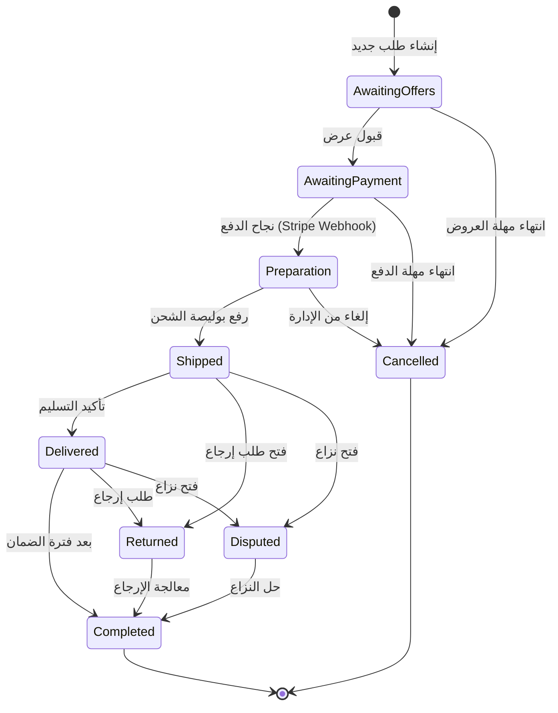
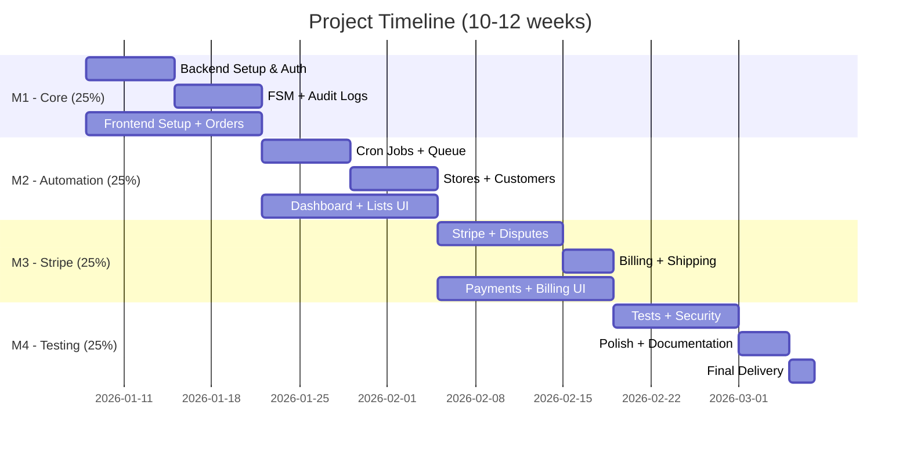
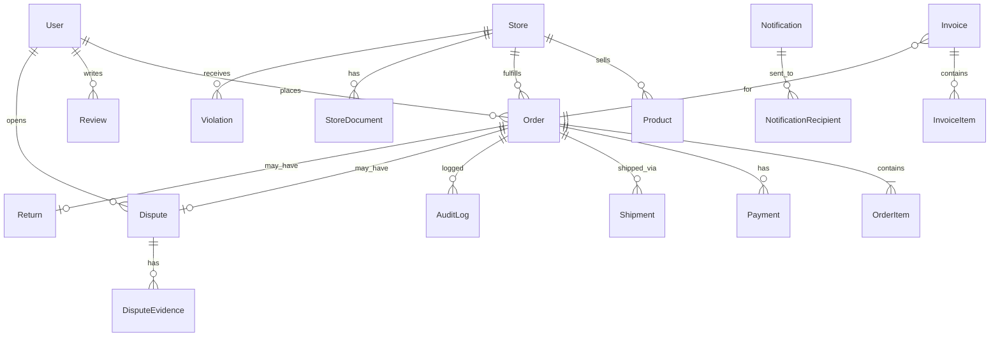

# 🏪 Marketplace Admin System

<div align="center">


**نظام إدارة متكامل للمتاجر والعملاء - Admin + Vendor Marketplace**

</div>

---


# 🎯 نظرة عامة

هذا المشروع هو **نظام إدارة متكامل لمنصة Marketplace** يهدف إلى إدارة كل جوانب العمليات التجارية بين المتاجر (Vendors) والعملاء (Customers) تحت إشراف الإدارة (Admin).

### ما الذي يميز هذا النظام؟

```
┌─────────────────────────────────────────────────────────────────┐
│                    Marketplace Admin System                      │
├─────────────────────────────────────────────────────────────────┤
│  ✓ FSM-Based Order Management (حتمي وموثق)                       │
│  ✓ Audit Logs لكل عملية (شفافية كاملة)                           │
│  ✓ Automated SLA Enforcement (تصعيد تلقائي)                      │
│  ✓ Stripe Integration (دفع آمن 100%)                            │
│  ✓ Real-time Notifications (WhatsApp + Email)                   │
│  ✓ Guard Protection (لا يمكن التلاعب بالحالات)                   │
└─────────────────────────────────────────────────────────────────┘
```

---

## 🎯 الأهداف الرئيسية

| الهدف | الوصف |
|-------|-------|
| **الحوكمة** | نظام مبني على قواعد صارمة لا يمكن تجاوزها |
| **الشفافية** | كل إجراء مسجل ومؤرخ مع ذكر المنفذ والسبب |
| **الأتمتة** | قواعد زمنية تعمل تلقائياً دون تدخل بشري |
| **الأمان** | حماية كاملة ضد جميع أنواع الهجمات |
| **القابلية للتوسع** | تصميم معماري يسمح بالنمو المستقبلي |

---

## ⚠️ المتطلبات التقنية الحرجة

> [!CAUTION]
> هذه المتطلبات **إلزامية** وأي إخلال بها يُعد خللاً جوهرياً في التنفيذ

### 1️⃣ Finite State Machine (FSM) - إلزامي
```
❌ ممنوع: تغيير order.status مباشرة من Controller
❌ ممنوع: تغيير order.status مباشرة من Database Query
❌ ممنوع: تغيير order.status عبر Script خارج FSM

✅ مطلوب: جميع تغييرات الحالة تمر عبر Service مركزية واحدة
```

### 2️⃣ Audit Logs - إلزامي
كل تغيير حالة يُسجل في جدول مستقل يحتوي على:
- `order_id` - معرف الطلب
- `previous_state` - الحالة السابقة
- `new_state` - الحالة الجديدة
- `actor_type` - نوع المنفذ (System / Admin / Customer / Vendor)
- `actor_id` - معرف المنفذ
- `reason` - سبب التغيير
- `timestamp` - وقت التغيير

### 3️⃣ Guard & Enforcement - إلزامي
```typescript
// يجب أن يكون هناك Guard معماري حقيقي بحيث:
// 1. يستحيل تقنياً تغيير حالة الطلب خارج FSM
// 2. أي محاولة تجاوز تفشل Runtime أو تُسقط Test
// 3. وجود FSM بدون Enforcement غير مقبول
```

---

## 🏗️ البنية المعمارية

```
┌────────────────────────────────────────────────────────────────────────┐
│                           Frontend Layer                                │
│  ┌────────────────┐  ┌────────────────┐  ┌────────────────┐            │
│  │  Admin Panel   │  │ Vendor Portal  │  │ Customer App   │            │
│  └───────┬────────┘  └───────┬────────┘  └───────┬────────┘            │
└──────────┼───────────────────┼───────────────────┼─────────────────────┘
           │                   │                   │
           ▼                   ▼                   ▼
┌────────────────────────────────────────────────────────────────────────┐
│                            API Gateway                                  │
│  ┌──────────────────────────────────────────────────────────────────┐  │
│  │  Authentication │ Authorization │ Rate Limiting │ Validation     │  │
│  └──────────────────────────────────────────────────────────────────┘  │
└────────────────────────────────────────────────────────────────────────┘
           │
           ▼
┌────────────────────────────────────────────────────────────────────────┐
│                         Application Layer                               │
│  ┌──────────────┐  ┌──────────────┐  ┌──────────────┐                  │
│  │   Orders     │  │   Stores     │  │  Customers   │                  │
│  │   Module     │  │   Module     │  │   Module     │                  │
│  └──────┬───────┘  └──────────────┘  └──────────────┘                  │
│         │                                                               │
│  ┌──────▼───────────────────────────────────────────────────────────┐  │
│  │              Order State Machine (FSM Service)                    │  │
│  │  ┌─────────┐ ┌─────────┐ ┌─────────┐ ┌─────────┐ ┌─────────┐     │  │
│  │  │ Guards  │ │Transitions│ │ Actions │ │ Events  │ │  Logs   │    │  │
│  │  └─────────┘ └─────────┘ └─────────┘ └─────────┘ └─────────┘     │  │
│  └──────────────────────────────────────────────────────────────────┘  │
│                                                                         │
│  ┌──────────────┐  ┌──────────────┐  ┌──────────────┐                  │
│  │   Billing    │  │   Disputes   │  │   Shipping   │                  │
│  │   Module     │  │   Module     │  │   Module     │                  │
│  └──────────────┘  └──────────────┘  └──────────────┘                  │
└────────────────────────────────────────────────────────────────────────┘
           │
           ▼
┌────────────────────────────────────────────────────────────────────────┐
│                         Background Services                             │
│  ┌──────────────┐  ┌──────────────┐  ┌──────────────┐                  │
│  │  Cron Jobs   │  │    Queues    │  │ Notifications│                  │
│  │  (Scheduled) │  │  (BullMQ)    │  │  (Real-time) │                  │
│  └──────────────┘  └──────────────┘  └──────────────┘                  │
└────────────────────────────────────────────────────────────────────────┘
           │
           ▼
┌────────────────────────────────────────────────────────────────────────┐
│                          Data Layer                                     │
│  ┌──────────────┐  ┌──────────────┐  ┌──────────────┐                  │
│  │  PostgreSQL  │  │    Redis     │  │  File Store  │                  │
│  │  (Primary)   │  │   (Cache)    │  │  (Documents) │                  │
│  └──────────────┘  └──────────────┘  └──────────────┘                  │
└────────────────────────────────────────────────────────────────────────┘
           │
           ▼
┌────────────────────────────────────────────────────────────────────────┐
│                      External Integrations                              │
│  ┌──────────────┐  ┌──────────────┐  ┌──────────────┐                  │
│  │    Stripe    │  │   WhatsApp   │  │    Email     │                  │
│  │  (Payments)  │  │   (Notifs)   │  │   (Notifs)   │                  │
│  └──────────────┘  └──────────────┘  └──────────────┘                  │
└────────────────────────────────────────────────────────────────────────┘
```

---

---

## 📦 الوحدات والميزات (Modules & Features)

> [!TIP]
> **تم تحديد هذه المواصفات بناءً على تحليل الواجهة الحالية والمرجعية للكود**

### 1. � المصادقة والصلاحيات (Auth & Roles)

#### نظام تسجيل الدخول (Authentication)
- **Admin**: Email + Password + JWT
- **Vendor**: Email + Password + JWT
- **Customer**: Email + Password + JWT
- **التحقق (Verification)**:
  - **WhatsApp OTP (أساسي)**: يتم إرسال رمز التحقق عبر واتساب.
  - **Email OTP (احتياطي)**: في حال عدم وجود واتساب، يستخدم البريد الإلكتروني.
  - **تفضيلات العميل**: يختار العميل الوسيلة المفضلة عند التسجيل.

#### الأدوار والصلاحيات (Roles)
| الدور | الصلاحيات |
|-------|-----------|
| **SUPER_ADMIN** | تحكم كامل + إدارة المدراء |
| **ADMIN** | إدارة الطلبات، المتاجر، العملاء، النزاعات |
| **SUPPORT** | قراءة فقط + التواصل مع العملاء |
| **VENDOR** | إدارة منتجاته وطلباته وشحناته فقط |
| **CUSTOMER** | إنشاء طلبات، قبول عروض، دفع |

---


### 2. �📊 لوحة الإدارة (Dashboard)
#### مؤشرات الأداء الرئيسية (KPIs)
- إجمالي المبيعات والعمولة (20%)
- عدد العملاء والمتاجر النشطة
- الطلبات حسب الحالة

#### التنبيهات الفورية (Alerts)
- ⚠️ متاجر لم ترد > 24 ساعة
- ⚠️ تأخر التجهيز > 48 ساعة
- ⚠️ تأخر رفع بوليصة الشحن
- ⚠️ نزاعات مفتوحة

#### مؤشرات الأداء الرئيسية (KPIs)
| المؤشر | الوصف |
|--------|--------|
| عدد العملاء | إجمالي العملاء المسجلين |
| عدد المتاجر | إجمالي المتاجر النشطة |
| عدد الطلبات | اليوم / الأسبوع / الشهر |
| إجمالي المبيعات | قيمة المبيعات المكتملة |
| إجمالي العمولة | نصيب المنصة من المبيعات |

#### حالات الطلبات
```
جديد → بانتظار الدفع → قيد التجهيز → شحن → مكتمل
                    ↓           ↓        ↓
                  ملغي      إرجاع     نزاع
```

#### التنبيهات الفورية
- ⚠️ متاجر لم ترد > 24 ساعة
- ⚠️ تأخر التجهيز > 48 ساعة
- ⚠️ تأخر رفع بوليصة الشحن
- ⚠️ شحنة متأخرة > 14 يوم
- ⚠️ انتهاء ترخيص متجر
- ⚠️ تقييم متجر منخفض
- ⚠️ طلب غير مدفوع

---

### 3. 🏬 نظام المتاجر (Stores Module)

#### دورة تسجيل المتجر (Onboarding)
1. **التسجيل الأولي**: البريد، الهاتف، كلمة المرور.
2. **العقد الإلكتروني**: تعبئة بيانات ثابتة (رقم السجل، اسم المفوض).
3. **رفع المستندات (إلزامي)**:
   - السجل التجاري (Commercial Registration)
   - الرخصة التجارية
   - خطاب بنكي (IBAN)
   - الهوية الوطنية
   - خطاب تفويض (للمفوض بالإدارة)
4. **المراجعة**: يراجع الأدمن المستندات ← تفعيل الحساب.

#### الميزات وعمليات المتجر
- **استقبال الطلبات**: استعراض طلبات العملاء الجديدة.
- **تقديم العروض**: إرسال عروض أسعار (Bid-based) تشمل السعر، الضمان، ووقت التوصيل.
- **إدارة الشحن**: رفع بوليصة الشحن وتحديث حالة التوصيل.
- **المحادثات**: التواصل المباشر مع العملاء للتفاوض.
- **الأرباح**: متابعة المستحقات المالية (تحول بعد اكتمال الطلب).

#### ملف المتجر
```
┌─────────────────────────────────────────────────┐
│                 Store Profile                    │
├─────────────────────────────────────────────────┤
│ 📋 البيانات الأساسية (الاسم، الوصف، الفئة)      │
│ 📄 الترخيص والمستندات                           │
│ 💳 وسائل الدفع + IBAN                           │
│ 👤 بيانات مسؤول المتجر                          │
│ 💰 الرصيد المالي                                │
│ ⚠️ سجل الانتهاكات                               │
└─────────────────────────────────────────────────┘
```

#### مؤشرات أداء المتجر (Store KPIs)
| المؤشر | الحد المقبول |
|--------|---------------|
| سرعة الرد | < 24 ساعة |
| سرعة التجهيز | < 48 ساعة |
| رفع البوليصة | < 24 ساعة بعد التجهيز |
| نسبة الشكاوى | < 5% |
| تقييم العملاء | >= 4.0/5 |

#### إجراءات الإدارة
- ✅ تفعيل / تعليق / إيقاف
- 🔒 Soft Block (إخفاء مؤقت)
- 💰 تعديل الرصيد
- 💬 مراجعة المحادثات
- ⚠️ إرسال تحذير

#### ⚠️ تنبيهات الرخصة التجارية (إلزامي)

> [!CAUTION]
> **مطلب أساسي من العميل**

| الحالة | الإجراء |
|--------|--------|
| **قبل 30 يوم من انتهاء الرخصة** | ✉️ تنبيه للمتجر + تنبيه للإدارة |
| **عند انتهاء الرخصة بدون تجديد** | ⛔ إيقاف المتجر تلقائياً + رسالة بسبب الإيقاف |
| **بعد التجديد** | إعادة تفعيل المتجر بعد مراجعة الأدمن |

---

### 3. 👥 نظام العملاء (Customers Module)

#### ملف العميل
- البيانات الشخصية
- الأجهزة ومحاولات الدخول
- سجل الطلبات والمدفوعات
- الشكاوى المرفوعة
- طلبات الإرجاع

#### إدارة التقييمات
- تقييمات معلّقة للمراجعة
- قبول / رفض التقييم
- حذف تقييم مسيء

---

### 5. 📦 نظام الطلبات (Orders Module)

#### مواصفات العرض (Offer Specs)
يقوم التاجر بإدخال البيانات التالية لكل عرض:
- **سعر القطعة**: (لا يراه العميل مباشرة).
- **الوزن (Weight)**: بالكيلوجرام (يحدد تكلفة الشحن تلقائياً).
- **الضمان (Warranty)**: نعم/لا.
- **صورة القطعة**: اختيارية.

#### منطق الشحن (Shipping Logic)
يقوم النظام بحساب تكلفة الشحن تلقائياً بناءً على الوزن المدخل:
- **الجدول 1 (القطع العادية)**: فئات وزن محددة (مثلاً 5-10 كجم = 100 درهم).
- **الجدول 2 (القطع الكبيرة)**: تسعير خاص للماكينة (Engine) والجيربوكس (Gearbox).
- **الاحتساب**: `تكلفة الشحن = الجدول(وزن القطعة)`.

#### الأسعار والعمولة (Pricing & Billing)
- **العمولة (Commission)**: 20% تضاف على إجمالي العرض.
- **للمدير (Admin)**: يرى تفصيل (سعر القطعة + الشحن + العمولة).
- **للعميل (Customer)**: يرى **السعر النهائي فقط** (Final Price).
- **للمتجر (Vendor)**: يرى استحقاقه (سعر القطعة - أي خصم).

#### حالات الطلب (FSM)
- **9 حالات كاملة**: (Awaiting Offers → Awaiting Payment → Preparation → Shipped → Delivered → Completed) + (Cancelled, Returned, Disputed).
- **حماية**: Guard يمنع التلاعب بالحالة، و Audit Log يسجل كل حركة.

#### حالات الطلب الكاملة




| المرحلة | المدة المسموحة | الإجراء عند التجاوز |
|---------|----------------|---------------------|
| العروض | 24 ساعة | إلغاء تلقائي |
| الدفع | 24 ساعة | إلغاء تلقائي |
| التجميع | 48 ساعة | تنبيه للإدارة |
| التجهيز | 48 ساعة | تنبيه + تحذير للمتجر |
| رفع البوليصة | 24 ساعة | تنبيه + غرامة محتملة |
| الشحن | 14 يوم | فتح متابعة تلقائية |
| استلام العميل | 7 أيام | تصعيد للإدارة |

---

### 5. 🚚 الشحن والإرجاع (Shipping & Returns)

#### تتبع الشحنات
- رقم البوليصة
- شركة الشحن
- حالة الشحنة
- تاريخ التوصيل المتوقع

#### إدارة الإرجاع
```
فتح طلب إرجاع (خلال 48 ساعة)
        ↓
نقاش بين العميل والمتجر (3 أيام)
        ↓
إصدار بوليصة إرجاع
        ↓
تسليم العميل (خلال 24 ساعة)
        ↓
استلام المتجر وإتمام الإرجاع
```

---

### 7. ⚖️ نظام النزاعات (Disputes)
#### إجراءات النزاع
- يحق للعميل فتح نزاع في حالة: تأخر الشحن، منتج معيب، عدم مطابقة.
- **قفل الأموال**: يتم تجميد المبلغ فور فتح النزاع.
- **التصعيد التلقائي**: إذا لم يرد التجر خلال 3 أيام، يصعد للإدارة.

#### دورة حياة النزاع

```
┌─────────────────────────────────────────────────────────────────┐
│                    Dispute Lifecycle                             │
├─────────────────────────────────────────────────────────────────┤
│  1. فتح النزاع (بواسطة العميل)                                  │
│     ↓                                                            │
│  2. رفع الأدلة (العميل)                                         │
│     ↓                                                            │
│  3. رد المتجر (3 أيام كحد أقصى)                                 │
│     ↓                                                            │
│  4. تصعيد تلقائي (في حال عدم الرد)                              │
│     ↓                                                            │
│  5. مراجعة الإدارة                                               │
│     ↓                                                            │
│  6. حكم الإدارة                                                  │
│     ↓                                                            │
│  7. القرار النهائي (رد المبلغ أو تحويله للمتجر)                 │
└─────────────────────────────────────────────────────────────────┘
```

> [!IMPORTANT]
> يتم قفل رصيد الطلب مالياً فور فتح النزاع حتى صدور القرار النهائي

---

### 8. 💰 النظام المالي (Billing & Finance)
#### هيكلة الفاتورة
- **فاتورة العميل**: تظهر رقماً واحداً (السعر النهائي الشامل).
- **فاتورة النظام الداخلية**: تفصل:
  1. سعر القطعة (للمتجر)
  2. سعر الشحن (لشركة الشحن/للمتجر)
  3. العمولة (للمنصة - 20%)

#### الإعدادات المالية
- **بوابة الدفع**: Stripe.
- **العملة**: العملة المحلية (SAR/KWD).
- **الفواتير**: إنشاء تلقائي للفاتورة عند الدفع.
- **التسوية**: تحويل أرباح التجار بعد انتهاء فترة الضمان.

#### أنواع الفواتير
| النوع | الوصف |
|-------|-------|
| فاتورة منتج | قيمة المنتجات |
| فاتورة عمولة | نسبة المنصة |
| فاتورة شحن | تكلفة الشحن |
| فاتورة شاملة | جميع المكونات |

#### خصائص الفاتورة
- رقم تسلسلي فريد
- QR Code للتحقق
- Barcode للمسح
- حالة الدفع
- ربط بالطلب والبوليصة

---

### 9. ⚙️ الإعدادات والأتمتة
#### إعدادات النظام (Admin Control)
- **إدارة المحتوى**: من نحن، السياسات، الشروط والأحكام.
- **إدارة البيانات**: الماركات (Brands)، أنواع السيارات (Models)، الفئات.
- **جداول الشحن**: تعديل أسعار الأوزان (Table 1 & Table 2).

#### قواعد الأتمتة
- مدد التشغيل (القواعد الزمنية)
- الصلاحيات والأدوار (Roles)
- نسبة عمولة النظام
- أسعار الشحن
- الصفحات (الشروط - من نحن)
- الفئات والماركات
- تصميم الفاتورة والبوليصة
- العقد الإلكتروني

#### قواعد الأتمتة
```javascript
// أمثلة على الأتمتة
{
  "auto_cancel_unpaid": {
    "condition": "order.status === 'AWAITING_PAYMENT' && elapsed > 24h",
    "action": "cancel_order",
    "notification": ["customer", "store"]
  },
  "escalate_dispute": {
    "condition": "dispute.status === 'AWAITING_STORE' && elapsed > 3days",
    "action": "escalate_to_admin",
    "notification": ["admin"]
  },
  "license_expiry_warning": {
    "condition": "store.license_expiry <= today + 30days",
    "action": "send_warning",
    "notification": ["store", "admin"]
  }
}
```

---

### 9. 🎧 الدعم الفني (Support Module)

- تذاكر الدعم
- سجل الأعطال
- التنبيهات
- إغلاق التذاكر
- تقييم الخدمة

---

## 🛠️ Technology Stack

### Backend
```
┌─────────────────────────────────────────────┐
│  Framework:    NestJS (Node.js)             │
│  Language:     TypeScript                    │
│  Database:     PostgreSQL                    │
│  ORM:          Prisma                        │
│  Cache:        Redis                         │
│  Queue:        BullMQ                        │
│  Auth:         JWT + Passport                │
└─────────────────────────────────────────────┘
```

### Frontend
```
┌─────────────────────────────────────────────┐
│  Framework:    React / Next.js              │
│  Language:     TypeScript                    │
│  State:        Zustand / React Query        │
│  UI:           Tailwind CSS                  │
│  Charts:       Recharts                      │
│  Forms:        React Hook Form + Zod        │
└─────────────────────────────────────────────┘
```

### DevOps & Tools
```
┌─────────────────────────────────────────────┐
│  Version Control:  Git                       │
│  CI/CD:           GitHub Actions            │
│  Containerization: Docker                   │
│  Documentation:    Swagger/OpenAPI          │
│  Testing:          Jest + Supertest         │
└─────────────────────────────────────────────┘
```

---

## 🌐 دعم اللغات (i18n)

| اللغة | الكود | الاتجاه | الحالة |
|-------|------|--------|--------|
| **العربية** | `ar` | RTL (يمين ليسار) | ✅ أساسي |
| **الإنجليزية** | `en` | LTR (يسار ليمين) | ✅ مطلوب |

### التنفيذ:
- تبديل اللغة من النافبار (علم الدولة أو اختصار)
- حفظ تفضيل اللغة في `localStorage`
- تغيير اتجاه الصفحة تلقائياً (RTL/LTR)
- مكتبة مقترحة: `next-intl` أو `react-i18next`

---

## 🔄 نظام حالات الطلب (FSM)

### تعريف الحالات

```typescript
enum OrderStatus {
  AWAITING_OFFERS = 'awaiting_offers',      // بانتظار عروض المتاجر
  AWAITING_PAYMENT = 'awaiting_payment',    // بانتظار الدفع
  PREPARATION = 'preparation',               // قيد التجهيز
  SHIPPED = 'shipped',                       // تم الشحن
  DELIVERED = 'delivered',                   // تم التوصيل
  COMPLETED = 'completed',                   // مكتمل
  CANCELLED = 'cancelled',                   // ملغي
  RETURNED = 'returned',                     // مرتجع
  DISPUTED = 'disputed'                      // نزاع
}
```

### خريطة الانتقالات المسموحة

```typescript
const validTransitions: Record<OrderStatus, OrderStatus[]> = {
  [OrderStatus.AWAITING_OFFERS]: [
    OrderStatus.AWAITING_PAYMENT,
    OrderStatus.CANCELLED
  ],
  [OrderStatus.AWAITING_PAYMENT]: [
    OrderStatus.PREPARATION,
    OrderStatus.CANCELLED
  ],
  [OrderStatus.PREPARATION]: [
    OrderStatus.SHIPPED,
    OrderStatus.CANCELLED
  ],
  [OrderStatus.SHIPPED]: [
    OrderStatus.DELIVERED,
    OrderStatus.RETURNED,
    OrderStatus.DISPUTED
  ],
  [OrderStatus.DELIVERED]: [
    OrderStatus.COMPLETED,
    OrderStatus.RETURNED,
    OrderStatus.DISPUTED
  ],
  [OrderStatus.RETURNED]: [
    OrderStatus.COMPLETED
  ],
  [OrderStatus.DISPUTED]: [
    OrderStatus.COMPLETED,
    OrderStatus.RETURNED
  ],
  [OrderStatus.COMPLETED]: [],  // الحالة النهائية
  [OrderStatus.CANCELLED]: []   // الحالة النهائية
};
```

### FSM Service Implementation

```typescript
@Injectable()
export class OrderStateMachine {
  constructor(
    private readonly prisma: PrismaService,
    private readonly auditLogService: AuditLogService,
  ) {}

  async transitionTo(
    orderId: string,
    newStatus: OrderStatus,
    actor: Actor,
    reason: string,
  ): Promise<Order> {
    return this.prisma.$transaction(async (tx) => {
      // 1. جلب الطلب الحالي مع قفل
      const order = await tx.order.findUnique({
        where: { id: orderId },
        select: { status: true },
      });

      if (!order) {
        throw new NotFoundException('Order not found');
      }

      // 2. التحقق من صحة الانتقال
      const currentStatus = order.status as OrderStatus;
      if (!this.isValidTransition(currentStatus, newStatus)) {
        throw new ForbiddenException(
          `Invalid transition from ${currentStatus} to ${newStatus}`
        );
      }

      // 3. تنفيذ الانتقال
      const updatedOrder = await tx.order.update({
        where: { id: orderId },
        data: { 
          status: newStatus,
          updatedAt: new Date(),
        },
      });

      // 4. تسجيل في Audit Log
      await tx.auditLog.create({
        data: {
          orderId,
          previousState: currentStatus,
          newState: newStatus,
          actorType: actor.type,
          actorId: actor.id,
          reason,
          timestamp: new Date(),
        },
      });

      return updatedOrder;
    });
  }

  private isValidTransition(from: OrderStatus, to: OrderStatus): boolean {
    return validTransitions[from]?.includes(to) ?? false;
  }
}
```

### Guard Implementation

```typescript
// منع أي تغيير مباشر لـ order.status خارج FSM
@Injectable()
export class OrderStatusGuard implements CanActivate {
  canActivate(context: ExecutionContext): boolean {
    const request = context.switchToHttp().getRequest();
    
    // التأكد من أن أي تعديل للـ status يمر عبر FSM
    if (request.body?.status) {
      throw new ForbiddenException(
        'Direct status modification is not allowed. Use FSM service.'
      );
    }
    
    return true;
  }
}
```

---

## ⏰ الأتمتة والجداول الزمنية

### Cron Jobs

```typescript
@Injectable()
export class AutomationService {
  constructor(
    private readonly orderMachine: OrderStateMachine,
    private readonly notificationService: NotificationService,
  ) {}

  // يعمل كل ساعة
  @Cron('0 * * * *')
  async cancelUnpaidOrders() {
    const expiredOrders = await this.prisma.order.findMany({
      where: {
        status: OrderStatus.AWAITING_PAYMENT,
        createdAt: {
          lt: subHours(new Date(), 24),
        },
      },
    });

    for (const order of expiredOrders) {
      await this.orderMachine.transitionTo(
        order.id,
        OrderStatus.CANCELLED,
        { type: 'SYSTEM', id: 'auto-cancel-job' },
        'Payment timeout exceeded 24 hours'
      );
    }
  }

  // يعمل كل 30 دقيقة
  @Cron('*/30 * * * *')
  async alertDelayedPreparation() {
    const delayedOrders = await this.prisma.order.findMany({
      where: {
        status: OrderStatus.PREPARATION,
        updatedAt: {
          lt: subHours(new Date(), 48),
        },
      },
    });

    for (const order of delayedOrders) {
      await this.notificationService.sendAlert({
        type: 'DELAYED_PREPARATION',
        orderId: order.id,
        recipients: ['admin', 'store'],
      });
    }
  }

  // يعمل يومياً
  @Cron('0 0 * * *')
  async escalateUnrespondedDisputes() {
    const unresponded = await this.prisma.dispute.findMany({
      where: {
        status: 'AWAITING_STORE_RESPONSE',
        createdAt: {
          lt: subDays(new Date(), 3),
        },
      },
    });

    for (const dispute of unresponded) {
      await this.orderMachine.transitionTo(
        dispute.orderId,
        OrderStatus.DISPUTED,
        { type: 'SYSTEM', id: 'dispute-escalation-job' },
        'Store did not respond within 3 days - Auto escalated'
      );
    }
  }
}
```

---

## 🔌 التكاملات

### Stripe Integration

```typescript
@Injectable()
export class StripeWebhookHandler {
  constructor(
    private readonly orderMachine: OrderStateMachine,
    private readonly stripe: Stripe,
  ) {}

  async handleWebhook(payload: Buffer, signature: string) {
    // 1. التحقق من Signature
    const event = this.stripe.webhooks.constructEvent(
      payload,
      signature,
      process.env.STRIPE_WEBHOOK_SECRET,
    );

    // 2. معالجة الحدث
    switch (event.type) {
      case 'payment_intent.succeeded':
        await this.handlePaymentSuccess(event.data.object);
        break;
      case 'payment_intent.payment_failed':
        await this.handlePaymentFailure(event.data.object);
        break;
      // ... المزيد من الأحداث
    }
  }

  private async handlePaymentSuccess(paymentIntent: any) {
    const orderId = paymentIntent.metadata.orderId;
    
    await this.orderMachine.transitionTo(
      orderId,
      OrderStatus.PREPARATION,
      { type: 'SYSTEM', id: 'stripe-webhook' },
      `Payment confirmed via Stripe: ${paymentIntent.id}`
    );
  }
}
```

> [!WARNING]
> **لا يتم اعتماد أي حالة مالية إلا عبر Webhook موثوق مع Verification Signature**
> **منع التلاعب بالحالات المالية يدوياً**

### WhatsApp & Email Notifications

```typescript
@Injectable()
export class NotificationService {
  async sendWhatsApp(phone: string, template: string, data: any) {
    // Implementation using WhatsApp Business API
  }

  async sendEmail(email: string, template: string, data: any) {
    // Implementation using SendGrid or similar
  }

  async sendAlert(alert: Alert) {
    const recipients = await this.getRecipients(alert.recipients);
    
    for (const recipient of recipients) {
      if (recipient.whatsapp) {
        await this.sendWhatsApp(recipient.phone, alert.type, alert);
      }
      if (recipient.email) {
        await this.sendEmail(recipient.email, alert.type, alert);
      }
    }
  }
}
```

---

## 🔒 الأمان والحماية

### متطلبات الأمان الإلزامية

| المتطلب | التنفيذ |
|---------|---------|
| Authentication | JWT + Refresh Tokens |
| Authorization | Role-Based Access Control (RBAC) |
| Rate Limiting | Express Rate Limit + Redis |
| Input Validation | Zod + Class Validator |
| SQL Injection | Prisma Parameterized Queries |
| XSS Protection | Helmet + HTML Sanitization |
| CSRF Protection | CSRF Tokens + SameSite Cookies |
| Data Encryption | bcrypt (passwords) + AES (sensitive data) |

### Security Middleware Stack

```typescript
// app.module.ts
@Module({
  imports: [
    ThrottlerModule.forRoot({
      ttl: 60,
      limit: 100,
    }),
    // ...
  ],
})
export class AppModule {}

// main.ts
async function bootstrap() {
  const app = await NestFactory.create(AppModule);
  
  // Security headers
  app.use(helmet());
  
  // CORS
  app.enableCors({
    origin: process.env.ALLOWED_ORIGINS.split(','),
    credentials: true,
  });
  
  // Validation
  app.useGlobalPipes(new ValidationPipe({
    whitelist: true,
    forbidNonWhitelisted: true,
  }));
  
  await app.listen(3000);
}
```


> [!CAUTION]
> **تأكيد العميل**: أي بدء في M1 دون هذه التحديدات سيُعد تنفيذًا غير مطابق وسيتسبب بإعادة بناء معمارية لاحقة.

---

## 1️⃣ نظام تسجيل الدخول (Authentication)

### الاقتراح المعتمد:

| نوع المستخدم | طريقة تسجيل الدخول | ملاحظات |
|--------------|---------------------|---------|
| **Admin** | Email + Password | مع JWT Token |
| **Vendor** | Email + Password | نفس النظام |
| **Customer** | Email + Password | (موجود في الواجهة الحالية) |

### التفاصيل:
```typescript
// نظام المصادقة
Authentication: JWT + Refresh Tokens
Password Hashing: bcrypt
Session: Stateless (JWT in localStorage/cookies)
```

> ✅ **للموافقة**: هل هذا النظام مناسب؟

---

## 2️⃣ الأدوار والصلاحيات (Roles & Permissions)

### الاقتراح المعتمد:

```
┌─────────────────────────────────────────────────────────────────┐
│                    Roles & Permissions                           │
├─────────────────────────────────────────────────────────────────┤
│                                                                  │
│  SUPER_ADMIN                                                     │
│  ├── جميع الصلاحيات                                              │
│  ├── إدارة المدراء                                               │
│  └── إعدادات النظام                                              │
│                                                                  │
│  ADMIN                                                           │
│  ├── إدارة الطلبات                                               │
│  ├── إدارة المتاجر                                               │
│  ├── إدارة العملاء                                               │
│  ├── إدارة النزاعات                                              │
│  └── عرض التقارير                                                │
│                                                                  │
│  SUPPORT                                                         │
│  ├── عرض الطلبات (قراءة فقط)                                     │
│  ├── عرض النزاعات                                                │
│  └── التواصل مع العملاء                                          │
│                                                                  │
│  VENDOR                                                          │
│  ├── إدارة عروضه فقط                                             │
│  ├── عرض طلباته                                                  │
│  └── إدارة الشحن                                                 │
│                                                                  │
│  CUSTOMER                                                        │
│  ├── إنشاء طلبات                                                 │
│  ├── قبول/رفض العروض                                             │
│  └── الدفع والتتبع                                               │
│                                                                  │
└─────────────────────────────────────────────────────────────────┘
```

### جدول الصلاحيات:

| الصلاحية | Super Admin | Admin | Support | Vendor | Customer |
|----------|:-----------:|:-----:|:-------:|:------:|:--------:|
| إدارة المدراء | ✅ | ❌ | ❌ | ❌ | ❌ |
| إعدادات النظام | ✅ | ❌ | ❌ | ❌ | ❌ |
| إدارة الطلبات | ✅ | ✅ | 👁️ | ⚡ | ⚡ |
| إدارة المتاجر | ✅ | ✅ | 👁️ | ❌ | ❌ |
| إدارة العملاء | ✅ | ✅ | 👁️ | ❌ | ❌ |
| إدارة النزاعات | ✅ | ✅ | 👁️ | ⚡ | ⚡ |
| التقارير | ✅ | ✅ | ❌ | ⚡ | ❌ |
| Audit Logs | ✅ | ✅ | ❌ | ❌ | ❌ |

**الرموز:**
- ✅ = صلاحية كاملة
- 👁️ = قراءة فقط
- ⚡ = صلاحية على بياناته فقط
- ❌ = لا صلاحية

> ✅ **للموافقة**: هل هذه الأدوار والصلاحيات مناسبة؟

---

## 3️⃣ وجود Vendor Dashboard

### الاقتراح المعتمد: ✅ نعم - مطلوب

```
┌─────────────────────────────────────────────────────────────────┐
│                    Vendor Dashboard                              │
├─────────────────────────────────────────────────────────────────┤
│                                                                  │
│  📊 Dashboard                                                    │
│     ├── إحصائيات المتجر                                          │
│     ├── العروض المقدمة                                           │
│     └── الطلبات الحالية                                          │
│                                                                  │
│  📦 الطلبات الواردة                                              │
│     ├── طلبات تحتاج عروض                                         │
│     ├── عروضي المقبولة                                           │
│     └── طلبات قيد التجهيز                                        │
│                                                                  │
│  💬 المحادثات                                                    │
│     └── محادثات مع العملاء                                       │
│                                                                  │
│  🚚 الشحن                                                        │
│     ├── رفع بوليصة الشحن                                         │
│     └── تتبع الشحنات                                             │
│                                                                  │
│  💰 الأرباح                                                      │
│     ├── المبالغ المستحقة                                         │
│     └── سجل المدفوعات                                            │
│                                                                  │
│  👤 ملف المتجر                                                   │
│     └── إدارة بيانات المتجر                                      │
│                                                                  │
└─────────────────────────────────────────────────────────────────┘
```

> ✅ **للموافقة**: هل هذه الصفحات مناسبة لـ Vendor Dashboard؟

---

## 4️⃣ اعتماد الواجهة كمرجع للـ Flow

### الاقتراح المعتمد: ✅ نعم - مع تحسينات

```
Flow المعتمد (من الواجهة الحالية):
══════════════════════════════════════════════════════════════

  [1] العميل ينشئ طلب
      │
      │  بيانات السيارة:
      │  - الشركة المصنعة (manufacturer)
      │  - نوع السيارة (carType)
      │  - سنة الصنع (year)
      │  
      │  القطع المطلوبة:
      │  - اسم القطعة
      │  - وصف
      │  - صورة (اختياري)
      │
      ▼
  [2] الطلب ينتظر العروض (24 ساعة)
      │
      ▼
  [3] التجار يرسلون عروض
      │
      │  بيانات العرض:
      │  - السعر
      │  - الضمان (نعم/لا)
      │  - وقت التوصيل
      │  - العمولة (20%)
      │
      ▼
  [4] العميل يرى العروض ويفتح محادثة
      │
      ▼
  [5] العميل يقبل العرض
      │
      ▼
  [6] العميل يؤكد بيانات الشحن
      │
      ▼
  [7] العميل يؤكد الطلب النهائي
      │
      ▼
  [8] العميل يدفع عبر Stripe
      │
      ▼
  [9] التاجر يجهز الطلب
      │
      ▼
  [10] التاجر يرفع بوليصة الشحن
      │
      ▼
  [11] العميل يستلم
      │
      ▼
  [12] إنشاء الفاتورة والتقرير النهائي

══════════════════════════════════════════════════════════════
```

### ما سيتم تحسينه:
| الـ Flow الحالي | التحسين المقترح |
|-----------------|-----------------|
| 5 حالات فقط | 9 حالات FSM كاملة |
| بدون Audit logs | Audit log لكل تغيير |
| بدون Guard | Guard يمنع التلاعب |
| Mock data | Backend حقيقي (NestJS) |

> ✅ **للموافقة**: هل هذا الـ Flow المعتمد؟

---

## 📦 ما تم استخلاصه من الواجهة الحالية

> تم تحليل الكود في `frontend-client/vue-ts-e-tashlehnet-1`

### التقنيات المستخدمة
```
Vue.js 3 + TypeScript + Vite
PrimeVue 4 + Tailwind CSS 4
Pinia (State Management)
Vue Router 4
Axios (HTTP)
Stripe.js (Payments)
```

### أنواع المستخدمين (من الكود)
```typescript
account_type: 'user' | 'vendor' | 'customer'
```

| النوع | الوصف | Dashboard موجود؟ |
|-------|-------|------------------|
| user | مدير/أدمن | ⚠️ صفحة واحدة فقط (ContentEditor) |
| vendor | تاجر | ✅ صفحة واحدة (VendorDashboard) |
| customer | عميل | ✅ 13 صفحة كاملة |

### العمولة (من الكود)
```typescript
commission_rate: number  // 20%
```

### نوع الشحن (من الكود)
```typescript
shippingType: 'separate' | 'combined'  // منفصل أو مجمع
```

---


| 1 | هل مطلوب بناء Vendor Dashboard؟ | نعم / لا |
| 2 | ما هي الميزات المطلوبة للتاجر؟ | استلام طلبات، تجهيز، شحن، أرباح، منتجات |
| 3 | هل التاجر يرفع منتجات؟ | نعم / لا |
| 4 | هل التاجر يقدم عروض أسعار؟ | نعم / لا |

### 1.2 Customer App (تطبيق العميل)
| # | السؤال | الخيارات المتاحة |
|---|--------|------------------|
| 1 | الواجهة الجاهزة عندكم Web أم Mobile؟ | Web / Mobile / Both |
| 2 | ما التقنية المستخدمة؟ | React / Vue / Flutter / Other |
| 3 | هل مطلوب ربطها بالـ Backend؟ | نعم / APIs فقط |
| 4 | هل يمكن مشاركة الكود للاطلاع؟ | نعم / لا |

---

## 2️⃣ أسئلة عن تسجيل الدخول والصلاحيات

### 2.1 نظام المستخدمين
| # | السؤال | الخيارات المتاحة |
|---|--------|------------------|
| 1 | كيف يسجل Admin الدخول؟ | Email+Password / SSO / Both |
| 2 | كيف يسجل Vendor الدخول؟ | Email+Password / Phone+OTP / Both |
| 3 | كيف يسجل Customer الدخول؟ | Email+Password / Phone+OTP / Social Login |
| 4 | هل هناك Super Admin؟ | نعم / لا |
| 5 | هل مطلوب Two-Factor Authentication؟ | نعم / لا |
| 6 | من ينشئ حسابات Admin؟ | Super Admin / يدوي من DB |

### 2.2 الصلاحيات (Roles)
| # | السؤال | ملاحظات |
|---|--------|---------|
| 1 | ما هي أدوار Admin المطلوبة؟ | مثال: Super Admin, Manager, Support |
| 2 | هل كل Admin له صلاحيات مختلفة؟ | تحديد الصلاحيات لكل دور |
| 3 | هل Vendor له أدوار فرعية؟ | Owner, Staff, etc. |

---


---

# ⚙️ المواصفات الفنية للنظام (System Specifications)

> [!TIP]
> **تم تحديد هذه المواصفات بناءً على تحليل الواجهة الحالية (Reference Code) وأفضل الممارسات**

## 1️⃣ أطراف النظام (System Actors)

| الطرف | الوصف | المنصة | طريقة الدخول |
|-------|-------|--------|--------------|
| **Admin** | إدارة النظام بالكامل | Web Dashboard | Email + Password |
| **Vendor** | المتاجر ومقدمي القطع | Vendor Portal | Email + Password |
| **Customer** | العملاء طالبي القطع | Web / Mobile App | Email + Password |

---

## 2️⃣ مواصفات نظام الطلبات (Order Specifications)

| الخاصية | التحديد المعتمد | المصدر |
|---------|-----------------|--------|
| **نظام العروض** | **Bid-based System**: العميل ينشئ طلب ← المتاجر تقدم عروض ← العميل يختار | `OfferChat.vue` |
| **التجميع (Aggregation)** | **Combined Shipping**: يدعم تجميع شحنات من متاجر متعددة أو شحن منفصل | `shippingType: 'separate' \| 'combined'` |
| **مهلة العروض** | **24 ساعة**: تنتهي صلاحية الطلب إذا لم تتقدم عروض | `expires_at` |
| **العمولة** | **20%**: يحصل النظام على 20% من قيمة كل عملية بيع | `commission_rate: 0.2` |
| **الضمان** | **اختياري**: يحدد التاجر وجود ضمان من عدمه في العرض | `has_warranty` |

---

## 3️⃣ مواصفات الشحن (Shipping Specifications)

| الخاصية | التحديد المعتمد |
|---------|-----------------|
| **نوع الشحن** | يتم تحديده بواسطة التاجر (وزن + تكلفة) أو شركات شحن (تكامل مستقبلي) |
| **التكلفة** | يدفعها العميل (تضاف للفاتورة النهائية) |
| **البوليصة** | يقوم التاجر برفع رقم البوليصة وصورة التوصيل يدوياً في المرحلة الأولى |
| **التتبع** | عبر رقم البوليصة (External Link) أو تحديثات الحالة الداخية |

---

## 4️⃣ نظام المحادثات (Communication)

| القناة | التفاصيل |
|--------|----------|
| **Customer ↔ Vendor** | ✅ **محادثة مباشرة** (Chat) يتم فتحها بمجرد تقديم عرض. تتيح التفاوض والاتفاق. |
| **Customer ↔ Support** | ✅ **تذاكر دعم** (Tickets) للمشاكل والشكاوى. |
| **Notifications** | Alerts داخل النظام + Email Notifications (للحالات الحرجة). |

---

## 5️⃣ الإعدادات المالية (Financial Settings)

| الإعداد | القيمة / الطريقة |
|---------|------------------|
| **بوابة الدفع** | **Stripe**: مدفوعات آمنة مع حجز المبلغ (Auth & Capture) |
| **العملة** | العملة المحلية (يحدد لاحقاً، الافتراضي SAR/KWD) |
| **الفواتير** | فاتورة إلكترونية تلقائية لكل طلب مكتمل |
| **تحويل الأرباح** | يتم تحويل مستحقات التاجر بعد اكتمال الطلب وانتهاء فترة الضمان |

---

# 👥 أطراف النظام

## الهيكل العام

```
┌─────────────────────────────────────────────────────────────────────────┐
│                      Marketplace Ecosystem                               │
├─────────────────────────────────────────────────────────────────────────┤
│                                                                          │
│   ┌──────────────┐  ┌──────────────┐  ┌──────────────┐                  │
│   │    ADMIN     │  │    VENDOR    │  │   CUSTOMER   │                  │
│   │   Dashboard  │  │   Dashboard  │  │     App      │                  │
│   │   (مطلوب)    │  │   (سؤال؟)   │  │   (جاهز)     │                  │
│   └──────┬───────┘  └──────┬───────┘  └──────┬───────┘                  │
│          │                 │                 │                           │
│          └─────────────────┼─────────────────┘                           │
│                            ▼                                             │
│                  ┌──────────────────┐                                    │
│                  │    BACKEND API   │                                    │
│                  │    (مطلوب)       │                                    │
│                  └──────────────────┘                                    │
│                                                                          │
└─────────────────────────────────────────────────────────────────────────┘
```

---

## 1️⃣ ADMIN (الإدارة)

### المعلومات الأساسية
| البند | التفاصيل |
|-------|----------|
| **Dashboard** | ✅ مطلوب (الهدف الأساسي) |
| **تسجيل الدخول** | Email + Password |
| **الصلاحيات** | RBAC (Super Admin, Admin, Support) |

### الصفحات المتوقعة
1. **Dashboard** - الإحصائيات والتنبيهات
2. **Orders** - إدارة الطلبات
3. **Stores** - إدارة المتاجر
4. **Customers** - إدارة العملاء
5. **Disputes** - إدارة النزاعات
6. **Billing** - الفواتير والمالية
7. **Settings** - الإعدادات
8. **Audit Logs** - سجل العمليات
9. **Support** - تذاكر الدعم

### الإجراءات المتاحة
- تغيير حالة الطلبات (عبر FSM)
- تعليق/حظر المتاجر والعملاء
- معالجة النزاعات
- إدارة الإعدادات

---

## 2️⃣ VENDOR (التاجر/المتجر)

### المعلومات الأساسية
| البند | التفاصيل |
|-------|----------|
| **Dashboard** | ⚠️ يحتاج توضيح من العميل |
| **تسجيل الدخول** | Email + Password (أو Phone + OTP؟) |
| **الصلاحيات** | Owner, Staff (يحتاج توضيح) |

### الصفحات المتوقعة (إذا مطلوب)
1. **Dashboard** - إحصائيات المتجر
2. **Orders** - الطلبات الواردة
3. **Products** - المنتجات (إذا مطلوب)
4. **Shipping** - إدارة الشحن
5. **Disputes** - النزاعات
6. **Earnings** - الأرباح
7. **Profile** - ملف المتجر

### السيناريوهات المتوقعة
```
العميل ينشئ طلب
      ↓
التاجر يستلم الطلب
      ↓
التاجر يجهز الطلب
      ↓
التاجر يرفع بوليصة الشحن
      ↓
العميل يستلم
```

---

## 3️⃣ CUSTOMER (العميل)

### المعلومات الأساسية
| البند | التفاصيل |
|-------|----------|
| **App/Frontend** | ✅ موجود (من العميل) |
| **تسجيل الدخول** | يحتاج توضيح |
| **الميزات** | تصفح، طلب، دفع، تتبع |

### الصفحات المتوقعة (للعلم - موجودة عند العميل)
1. **Home** - الصفحة الرئيسية
2. **Products** - المنتجات
3. **Cart** - السلة
4. **Checkout** - الدفع
5. **Orders** - طلباتي
6. **Profile** - حسابي

---

## 4️⃣ SYSTEM (النظام)

### العمليات الآلية
| العملية | الوصف |
|---------|-------|
| Auto-Cancel | إلغاء الطلبات غير المدفوعة بعد 24 ساعة |
| Auto-Escalate | تصعيد النزاعات بعد 3 أيام |
| Alerts | تنبيهات التأخير |
| SLA Enforcement | تطبيق قواعد الـ SLA |

---

#
---


## 📅 مراحل التنفيذ (Vertical Slicing)

> [!TIP]
> **استراتيجية التطوير**: نقوم بتطوير **Backend + Frontend معاً** في كل مرحلة، مما يضمن نظام عامل ومرئي من البداية.

```
┌─────────────────────────────────────────────────────────────────┐
│                    Vertical Slicing Approach                     │
│  ┌─────────┐  ┌─────────┐  ┌─────────┐  ┌─────────┐            │
│  │   M1    │  │   M2    │  │   M3    │  │   M4    │            │
│  │ ─────── │  │ ─────── │  │ ─────── │  │ ─────── │            │
│  │ Backend │  │ Backend │  │ Backend │  │ Backend │            │
│  │    +    │  │    +    │  │    +    │  │    +    │            │
│  │Frontend │  │Frontend │  │Frontend │  │Frontend │            │
│  │ ─────── │  │ ─────── │  │ ─────── │  │ ─────── │            │
│  │ Working │  │ Working │  │ Working │  │ Working │            │
│  │ Feature │  │ Feature │  │ Feature │  │ Feature │            │
│  └─────────┘  └─────────┘  └─────────┘  └─────────┘            │
└─────────────────────────────────────────────────────────────────┘
```

## 🏗️ M1: Landing Page + Auth + Core Admin (25%)
**المدة: 2-3 أسابيع**

### 📄 الصفحات المطلوب تسليمها

#### 1️⃣ الصفحات العامة (Public Pages)
| الصفحة | الوصف | الحالة |
|--------|-------|--------|
| **Landing Page** | صفحة هبوط احترافية للمنصة | [ ] |
| **About Us** | من نحن | [ ] |
| **How We Work** | كيف نعمل (شرح خطوات الخدمة) | [ ] |
| **Terms & Conditions** | الشروط والأحكام | [ ] |
| **Privacy Policy** | سياسة الخصوصية | [ ] |
| **Return Policy** | سياسة الإرجاع | [ ] |
| **Contact Us** | تواصل معنا | [ ] |

#### 2️⃣ صفحات المصادقة (Auth Pages)
| الصفحة | الوصف | الحالة |
|--------|-------|--------|
| **Customer Login** | تسجيل دخول العميل | [ ] |
| **Customer Register** | تسجيل عميل جديد + WhatsApp/Email OTP | [ ] |
| **Vendor Login** | تسجيل دخول التاجر | [ ] |
| **Vendor Register** | تسجيل تاجر جديد (Step 1: بيانات أساسية) | [ ] |
| **Vendor Onboarding** | رفع المستندات + العقد الإلكتروني | [ ] |
| **Admin Login** | تسجيل دخول الأدمن | [ ] |
| **Forgot Password** | استعادة كلمة المرور | [ ] |

#### 3️⃣ لوحة الأدمن (Admin Dashboard - Basic)
| الصفحة | الوصف | الحالة |
|--------|-------|--------|
| **Dashboard** | إحصائيات + KPIs بسيطة | [ ] |
| **Orders List** | قائمة الطلبات + تغيير الحالة | [ ] |
| **Order Details** | تفاصيل الطلب + Timeline + FSM | [ ] |
| **Audit Logs** | سجل العمليات | [ ] |

---

### ⚙️ الميزات التقنية (Backend)
- [ ] إعداد NestJS + Prisma + PostgreSQL
- [ ] تصميم Database Schema (Users, Orders, Stores, AuditLogs)
- [ ] Auth Module (Login/Register + JWT + WhatsApp OTP)
- [ ] Order FSM Service + Guards
- [ ] Audit Logs System
- [ ] Basic CRUD APIs
- [ ] Static Pages API (Terms, About, etc.)

### 🎨 الميزات التقنية (Frontend)
- [ ] إعداد Next.js + React + Tailwind |
- [ ] Layout + RTL + Dark/Light Theme
- [ ] Landing Page (تصميم احترافي)
- [ ] Static Pages (About, Terms, etc.)
- [ ] Auth Pages + OTP Flow
- [ ] Admin Dashboard Layout
- [ ] Orders Management UI

---

### ✅ الميزات الإلزامية
| الميزة | الوصف | إلزامي |
|--------|-------|--------|
| Landing Page | صفحة هبوط جذابة | ✅ |
| Auth System | JWT + WhatsApp/Email OTP | ✅ |
| Order FSM | إدارة حالات الطلب (9 حالات) | ✅ |
| FSM Guard | منع التغيير المباشر | ✅ |
| Audit Logs | تسجيل كل عملية | ✅ |
| Vendor Onboarding | رفع مستندات + عقد | ✅ |

---

### 🎯 Demo للعميل (نهاية M1)
```
✅ Landing Page احترافية
✅ صفحات ثابتة (من نحن، الشروط، إلخ)
✅ تسجيل عميل جديد + OTP
✅ تسجيل تاجر جديد + رفع مستندات
✅ تسجيل دخول Admin
✅ عرض Dashboard + KPIs
✅ عرض قائمة الطلبات
✅ تغيير حالة طلب (FSM working)
✅ عرض Audit Log
```

---

## ⚙️ M2: Automation + Stores + Customers (25%)
**المدة: 2-3 أسابيع**

### الصفحات
| الصفحة | الوصف | الحالة |
|--------|-------|--------|
| Dashboard | KPIs + Charts كاملة | [ ] |
| Stores List | قائمة المتاجر | [ ] |
| Store Profile | ملف متجر | [ ] |
| Customers List | قائمة العملاء | [ ] |
| Customer Profile | ملف عميل | [ ] |
| Notifications | التنبيهات | [ ] |
| Settings | الإعدادات الأساسية | [ ] |


#### Backend
- [ ] Cron Jobs Service
- [ ] Redis + BullMQ Queue
- [ ] Notifications Service
- [ ] Stores Module (CRUD + KPIs)
- [ ] Customers Module
- [ ] SLA Rules Engine

#### Frontend
- [ ] Dashboard Page + KPIs + Charts
- [ ] Alerts Section
- [ ] Stores List + Profile Page
- [ ] Customers List + Profile Page
- [ ] Settings Page (Basic)


### الميزات
| الميزة | الوصف | إلزامي |
|--------|-------|--------|
| Cron Jobs | مهام مجدولة | ✅ |
| Auto-Cancel | إلغاء بعد 24 ساعة | ✅ |
| Alerts | تنبيهات التأخير | ✅ |
| Store KPIs | مؤشرات أداء المتجر | ✅ |
| Store Actions | تعليق/حظر | ✅ |

### المتطلبات الإلزامية من العميل
- [ ] قائمة التنبيهات المطلوبة
- [ ] KPIs المطلوبة
- [ ] مدد SLA النهائية

### السيناريوهات المتوقعة

#### ✅ سيناريوهات إيجابية
| # | السيناريو | النتيجة |
|---|-----------|---------|
| 1 | طلب غير مدفوع > 24 ساعة | إلغاء تلقائي |
| 2 | متجر لم يرد > 24 ساعة | تنبيه للإدارة |
| 3 | عرض Dashboard | KPIs صحيحة |

#### ⚠️ سيناريوهات سلبية (معالجة)
| # | السيناريو | المعالجة |
|---|-----------|----------|
| 1 | Cron Job يفشل | Retry + Log Error |
| 2 | لا يوجد بيانات | عرض حالة فارغة |

---

## 💳 M3: Stripe + Disputes + Billing (25%)
**المدة: 2-3 أسابيع**

### الصفحات
| الصفحة | الوصف | الحالة |
|--------|-------|--------|
| Disputes List | قائمة النزاعات | [ ] |
| Dispute Details | تفاصيل نزاع | [ ] |
| Invoices | الفواتير | [ ] |
| Invoice View | عرض فاتورة + QR | [ ] |
| Shipping | تتبع الشحن | [ ] |


#### Backend
- [ ] Stripe Integration + Webhooks
- [ ] Disputes Module (Lifecycle)
- [ ] Billing Module (Invoices)
- [ ] Shipping Module
- [ ] WhatsApp + Email Integration
- [ ] Advanced Security

#### Frontend
- [ ] Payment UI + Status
- [ ] Disputes Page + Evidence Upload
- [ ] Invoices Page + QR View
- [ ] Shipping Tracking
- [ ] Notification Center


### الميزات
| الميزة | الوصف | إلزامي |
|--------|-------|--------|
| Stripe Webhooks | استقبال أحداث الدفع | ✅ |
| Signature Verify | التحقق من صحة Webhook | ✅ |
| Dispute Lifecycle | دورة حياة النزاع | ✅ |
| Auto-Escalate | تصعيد تلقائي | ✅ |
| QR Invoice | فاتورة بـ QR | ✅ |

### المتطلبات الإلزامية من العميل
- [ ] Stripe Account (Test + Live Keys)
- [ ] تصميم الفاتورة
- [ ] قواعد النزاعات النهائية

### السيناريوهات المتوقعة

#### ✅ سيناريوهات إيجابية
| # | السيناريو | النتيجة |
|---|-----------|---------|
| 1 | دفع ناجح | Webhook → Order PREPARATION |
| 2 | فتح نزاع | قفل المبلغ + بدء المهلة |
| 3 | تصعيد بعد 3 أيام | انتقال لمراجعة الإدارة |

#### ⚠️ سيناريوهات سلبية (معالجة)
| # | السيناريو | المعالجة |
|---|-----------|----------|
| 1 | Webhook بدون Signature | رفض الطلب |
| 2 | دفع فاشل | إشعار للعميل |

---

## 🧪 M4: Testing + Delivery (25%)
**المدة: 2-3 أسابيع**

### الاختبارات
| النوع | التغطية | الحالة |
|-------|---------|--------|
| Unit Tests | 80%+ | [ ] |
| Integration Tests | FSM + APIs | [ ] |
| E2E Tests | السيناريوهات الكاملة | [ ] |
| Security Audit | OWASP Top 10 | [ ] |


#### Backend
- [ ] Unit Tests (80%+ Coverage)
- [ ] Integration Tests
- [ ] E2E Tests
- [ ] Security Audit
- [ ] API Documentation (Swagger)
- [ ] Performance Optimization

#### Frontend
- [ ] UI Polish + Animations
- [ ] Responsive Design
- [ ] Error Handling + Loading States
- [ ] Final Testing
- [ ] Build Optimization


### التسليمات
| التسليم | الوصف | الحالة |
|---------|-------|--------|
| Source Code | الكود الكامل | [ ] |
| Documentation | توثيق كامل | [ ] |
| API Docs | Swagger | [ ] |
| Demo Video | فيديو شرح | [ ] |
| Deployment | نشر على السيرفر | [ ] |

---
---

### 📊 ملخص المراحل

| المرحلة | Backend | Frontend | الناتج |
|---------|---------|----------|--------|
| **M1** | Auth + FSM + Audit | Login + Orders | نظام طلبات أساسي |
| **M2** | Automation + Modules | Dashboard + Lists | لوحة تحكم كاملة |
| **M3** | Stripe + Disputes | Payments + Billing | تكاملات خارجية |
| **M4** | Testing + Docs | Polish + Deploy | نظام جاهز للإنتاج |

---

### ⏰ Timeline



---

## 📁 هيكل المشروع

```
marketplace-admin-system/
├── 📂 backend/
│   ├── 📂 src/
│   │   ├── 📂 modules/
│   │   │   ├── 📂 auth/
│   │   │   │   ├── auth.controller.ts
│   │   │   │   ├── auth.service.ts
│   │   │   │   ├── auth.module.ts
│   │   │   │   ├── strategies/
│   │   │   │   └── guards/
│   │   │   ├── 📂 orders/
│   │   │   │   ├── orders.controller.ts
│   │   │   │   ├── orders.service.ts
│   │   │   │   ├── orders.module.ts
│   │   │   │   ├── fsm/
│   │   │   │   │   ├── order-state-machine.ts
│   │   │   │   │   ├── transitions.ts
│   │   │   │   │   └── guards.ts
│   │   │   │   └── dto/
│   │   │   ├── 📂 stores/
│   │   │   ├── 📂 customers/
│   │   │   ├── 📂 disputes/
│   │   │   ├── 📂 billing/
│   │   │   ├── 📂 shipping/
│   │   │   ├── 📂 notifications/
│   │   │   └── 📂 audit-logs/
│   │   ├── 📂 common/
│   │   │   ├── 📂 decorators/
│   │   │   ├── 📂 filters/
│   │   │   ├── 📂 interceptors/
│   │   │   ├── 📂 pipes/
│   │   │   └── 📂 utils/
│   │   ├── 📂 config/
│   │   ├── 📂 database/
│   │   │   └── 📂 prisma/
│   │   │       ├── schema.prisma
│   │   │       └── migrations/
│   │   ├── 📂 jobs/
│   │   │   ├── cron.service.ts
│   │   │   └── queue.processor.ts
│   │   ├── 📂 integrations/
│   │   │   ├── stripe/
│   │   │   ├── whatsapp/
│   │   │   └── email/
│   │   ├── app.module.ts
│   │   └── main.ts
│   ├── 📂 test/
│   ├── package.json
│   ├── tsconfig.json
│   └── .env.example
│
├── 📂 frontend/
│   ├── 📂 src/
│   │   ├── 📂 app/
│   │   ├── 📂 components/
│   │   ├── 📂 features/
│   │   ├── 📂 hooks/
│   │   ├── 📂 services/
│   │   ├── 📂 store/
│   │   ├── 📂 styles/
│   │   └── 📂 utils/
│   ├── package.json
│   └── next.config.js
│
├── 📂 docs/
│   ├── api/
│   ├── architecture/
│   └── deployment/
│
├── 📂 docker/
│   ├── Dockerfile.backend
│   ├── Dockerfile.frontend
│   └── docker-compose.yml
│
├── .gitignore
├── README.md
└── LICENSE
```

---

## 🗃️ قاعدة البيانات

### Entity Relationship Diagram



### Prisma Schema (Simplified)

```prisma
// schema.prisma

model User {
  id            String    @id @default(uuid())
  email         String    @unique
  phone         String?
  passwordHash  String
  role          UserRole
  createdAt     DateTime  @default(now())
  updatedAt     DateTime  @updatedAt
  
  orders        Order[]
  reviews       Review[]
  disputes      Dispute[]
}

model Store {
  id            String    @id @default(uuid())
  name          String
  description   String?
  ownerId       String
  status        StoreStatus
  balance       Decimal   @default(0)
  rating        Float     @default(0)
  licenseExpiry DateTime?
  createdAt     DateTime  @default(now())
  updatedAt     DateTime  @updatedAt
  
  owner         User      @relation(fields: [ownerId], references: [id])
  products      Product[]
  orders        Order[]
  documents     StoreDocument[]
  violations    Violation[]
}

model Order {
  id            String    @id @default(uuid())
  orderNumber   String    @unique
  customerId    String
  storeId       String?
  status        OrderStatus
  totalAmount   Decimal
  createdAt     DateTime  @default(now())
  updatedAt     DateTime  @updatedAt
  
  customer      User      @relation(fields: [customerId], references: [id])
  store         Store?    @relation(fields: [storeId], references: [id])
  items         OrderItem[]
  payments      Payment[]
  shipments     Shipment[]
  auditLogs     AuditLog[]
  dispute       Dispute?
  return        Return?
}

model AuditLog {
  id            String    @id @default(uuid())
  orderId       String
  previousState String
  newState      String
  actorType     ActorType
  actorId       String?
  reason        String
  timestamp     DateTime  @default(now())
  metadata      Json?
  
  order         Order     @relation(fields: [orderId], references: [id])
  
  @@index([orderId])
  @@index([timestamp])
}

enum OrderStatus {
  AWAITING_OFFERS
  AWAITING_PAYMENT
  PREPARATION
  SHIPPED
  DELIVERED
  COMPLETED
  CANCELLED
  RETURNED
  DISPUTED
}

enum ActorType {
  SYSTEM
  ADMIN
  CUSTOMER
  STORE
}
```

---

## 📖 API Documentation

### Authentication Endpoints

| Method | Endpoint | Description |
|--------|----------|-------------|
| POST | `/auth/login` | تسجيل الدخول |
| POST | `/auth/register` | إنشاء حساب جديد |
| POST | `/auth/refresh` | تحديث الـ Token |
| POST | `/auth/logout` | تسجيل الخروج |

### Orders Endpoints

| Method | Endpoint | Description |
|--------|----------|-------------|
| GET | `/orders` | جلب قائمة الطلبات |
| GET | `/orders/:id` | جلب تفاصيل طلب |
| POST | `/orders` | إنشاء طلب جديد |
| PATCH | `/orders/:id/transition` | تغيير حالة الطلب (عبر FSM) |
| GET | `/orders/:id/timeline` | جلب تاريخ الطلب |

### Example: Transition Order Status

```http
PATCH /orders/123e4567-e89b-12d3-a456-426614174000/transition
Authorization: Bearer <token>
Content-Type: application/json

{
  "newStatus": "shipped",
  "reason": "Order has been shipped via Aramex"
}
```

---

## 🚀 التشغيل والنشر

### متطلبات البيئة

```bash
Node.js >= 18.x
PostgreSQL >= 14
Redis >= 6
```

### التثبيت والتشغيل

```bash
# Clone the repository
git clone https://github.com/your-org/marketplace-admin-system.git
cd marketplace-admin-system

# Install dependencies
cd backend && npm install
cd ../frontend && npm install

# Setup environment
cp backend/.env.example backend/.env
# Edit .env with your credentials

# Run database migrations
cd backend
npx prisma migrate dev

# Start development servers
npm run dev         # Backend on port 3000
npm run dev:frontend # Frontend on port 3001
```

### Docker Deployment

```bash
docker-compose up -d
```


# 📜 العقد الكامل

## أولاً: أطراف العقد
| الطرف | الاسم |
|-------|-------|
| الطرف الأول (صاحب المشروع) | عبدالكريم الخريف |
| الطرف الثاني (المطور) | م. محمد عصام وفريق عمل تحت إشرافه المعماري المباشر |
| مدة التنفيذ | 10-12 أسبوع |
| **الضمان** | 60 يوم بعد التسليم |
| **السرية** | NDA سارية حتى بعد انتهاء العقد |
| **الملكية الفكرية** | جميع الأكواد ملك للطرف الأول |

> [!IMPORTANT]
> **التنفيذ عبر فريق عمل**: يظل الطرف الثاني مسؤولاً مسؤولية قانونية وتقنية كاملة عن جودة الكود والالتزام بالمعمارية. لا يُقبل أي إخلال بحجة توزيع المهام أو خطأ أحد أعضاء الفريق.

---

## التمهيد والتعريفات

| البند | التفاصيل |
|-------|----------|
| الواجهة الحالية | مرجع بصري ووظيفي فقط، لا تُشكّل قيدًا تقنيًا |
| صلاحية التعديل | الطرف الثاني يملك كامل الصلاحية في تعديل أو إعادة بناء الواجهة |
| الأولوية | بناء Backend / Admin / Business Logic آمن وقابل للتوسع | 
---

## ثانياً: نطاق المشروع

### المطلوب تطويره
- ✅ Admin System
- ⚠️ Vendor Dashboard (يحتاج تأكيد)
- ✅ Customer Management
- ✅ Order Management System
- ✅ Automation & Cron Jobs
- ✅ Audit Logs System
- ✅ Billing & Finance
- ✅ Disputes & SLA
- ✅ Stripe Integration
- ✅ Email / WhatsApp Integration
- ✅ API Backend

---

## ثالثاً: البنود الإلزامية

### 1. FSM (Finite State Machine) ⚠️ إلزامي
```
❌ ممنوع: تغيير order.status من Controller
❌ ممنوع: تغيير order.status من Database مباشرة
❌ ممنوع: تغيير order.status عبر Script خارجي
✅ مطلوب: جميع التغييرات عبر Service مركزية واحدة
```

### 2. Audit Logs ⚠️ إلزامي
كل تغيير حالة يُسجل:
- order_id
- previous_state
- new_state
- actor_type (System/Admin/Customer)
- actor_id
- reason
- timestamp

> **أي تغيير حالة دون Audit Log = إخلال جوهري بالعقد**

### 3. Guard & Enforcement ⚠️ إلزامي
- يستحيل تقنياً تغيير الحالة خارج FSM
- أي محاولة تجاوز تفشل Runtime أو تُسقط Test

### 4. Stripe Integration ⚠️ حرج
- ربط كامل مع Webhooks
- Verification Signature باستخدام المفاتيح الرسمية
- رفض أي Webhook غير موثّق أو غير مطابق للتوقيع
- منع التلاعب بالحالات المالية يدوياً
- **منع Logic Bypass**
- **منع Replay Attacks**
- **منع Duplicate Events Processing**

> [!CAUTION]
> أي تعديل أو تلاعب مالي أو تشغيلي غير مصرح به يُعد خللًا جوهريًا في التنفيذ وسببًا كافيًا لرفض التسليم

### 5. الأمان والحماية ⚠️ إلزامي
- OWASP Best Practices
- Authentication & Authorization
- Rate Limiting
- Input Validation
- تشفير البيانات الحساسة (At Rest & In Transit)
- حماية من: SQL Injection, XSS, CSRF
- **حماية من Business Logic Exploits**
- **حماية من Unauthorized Access**

---

## رابعاً: Milestones والدفع

| المرحلة | الوصف | النسبة |
|---------|-------|--------|
| M1 | Core Architecture + FSM | 25% |
| M2 | Automation + Audit Logs | 25% |
| M3 | APIs + Stripe + Security | 25% |
| M4 | Testing + Documentation + Delivery | 25% |

---

## خامساً: الضمان (60 يوم)
ضمان فني كامل يشمل:
- إصلاح Bugs
- FSM
- Audit Logs
- Automation
- Stripe
- Security
- Frontend Integration

---

## سادساً: السرية (NDA)
- جميع الأكواد ملك للطرف الأول
- يمنع نشر أو مشاركة المشروع
- السرية مستمرة بعد انتهاء العقد

---

## سابعاً: قاعدة البيانات
| البيئة | قاعدة البيانات |
|--------|----------------|
| الاختبار (اختيارية) | SQLite |
| الإنتاج | PostgreSQL أو MySQL |

> يلتزم الطرف الثاني باستخدام ORM يضمن سهولة الانتقال بين قواعد البيانات وفصل تام بين Data Layer و Domain Logic

---

## ثامناً: البند الجزائي

| الحالة | الإجراء |
|--------|---------|
| تأخير غير مبرر | تعليق الدفعة أو خصم حتى 50% من قيمة المرحلة |
| خلل جوهري | رفض التسليم أو إنهاء العقد دون التزام مالي |

---

## تاسعاً: التسليمات المطلوبة
- [ ] Repository كامل
- [ ] Database Schema
- [ ] API Documentation (Swagger)
- [ ] User Manual
- [ ] Tests أساسية
- [ ] فيديو شرح أو جلسة مراجعة مباشرة

---

## عاشراً: إنهاء العقد
- يحق لأي طرف إنهاء العقد عند الإخلال الجوهري
- يتم تسليم ما أُنجز حتى تاريخ الإنهاء
- هذا العقد ملزم للطرفين

---

# 🔧 المتطلبات التقنية

## Technology Stack
| الطبقة | التقنية |
|--------|---------|
| Backend | NestJS + TypeScript |
| Database | PostgreSQL + Prisma |
| Cache | Redis |
| Queue | BullMQ |
| Frontend | Next.js + React + Tailwind |
| Payments | Stripe |
| Auth | JWT + Passport |

---

## الأمان
| المتطلب | التنفيذ |
|---------|---------|
| Authentication | JWT + Refresh Tokens |
| Authorization | RBAC |
| Rate Limiting | Express Rate Limit |
| SQL Injection | Prisma (Parameterized) |
| XSS | Helmet |
| CSRF | CSRF Tokens |
| Encryption | bcrypt + AES |

---

<div align="center">

**📧 في انتظار إجابات العميل على الأسئلة أعلاه**

</div>

---

## 📞 التواصل

**م. محمد عصام** - Senior Software Engineer

---

<div align="center">

**🔒 Proprietary & Confidential**

*هذا المشروع محمي بموجب اتفاقية السرية (NDA)*

</div>


